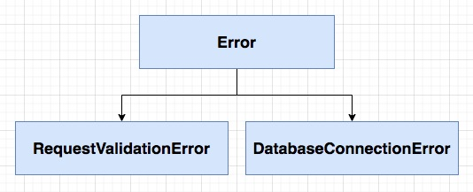
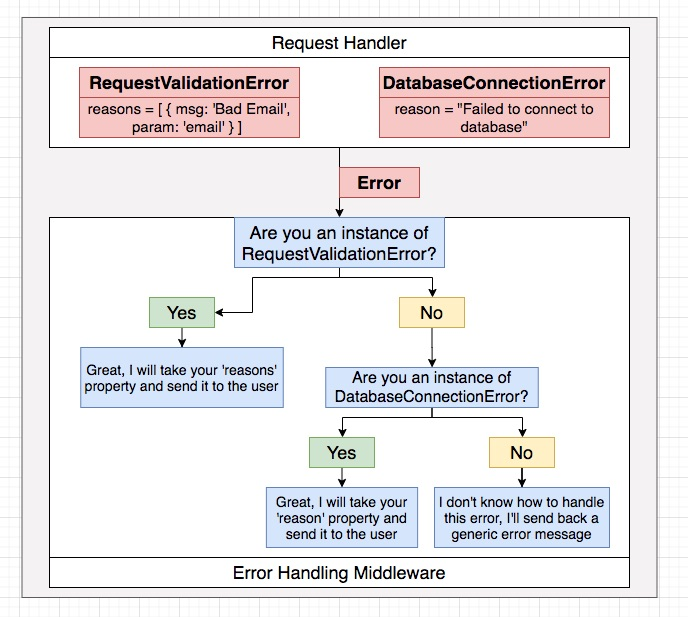
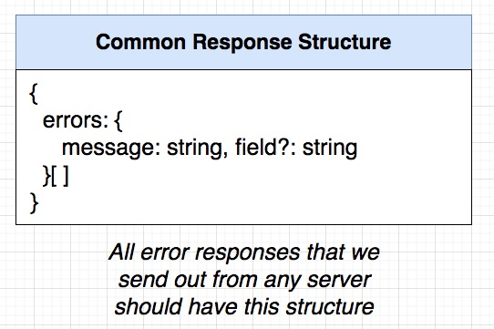
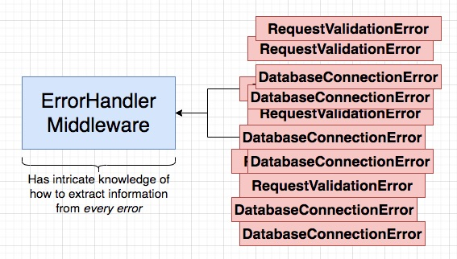
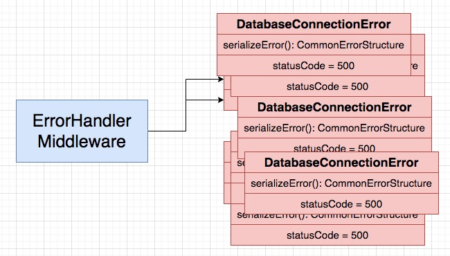
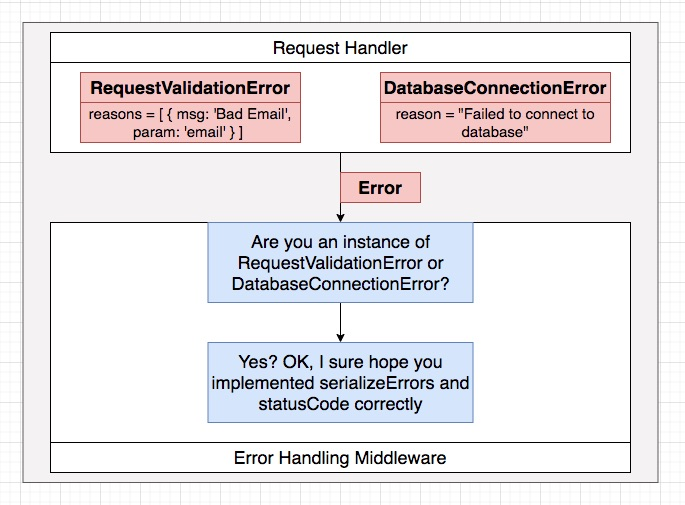
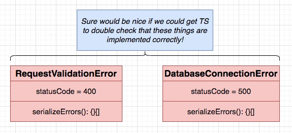
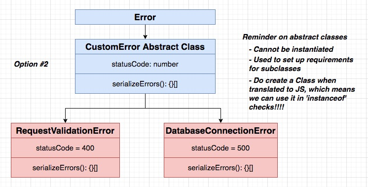

## **Section 07: Response Normalization Strategies**

## Table of Contents
- [**Section 07: Response Normalization Strategies**](#section-07-response-normalization-strategies)
- [Table of Contents](#table-of-contents)
  - [Creating Route Handlers](#creating-route-handlers)
  - [Scaffolding Routes](#scaffolding-routes)
  - [Adding Validation](#adding-validation)
  - [Handling Validation Errors](#handling-validation-errors)
  - [Surprising Complexity Around Errors](#surprising-complexity-around-errors)
  - [Other Sources of Errors](#other-sources-of-errors)
  - [Solution for Error Handling](#solution-for-error-handling)
  - [Building an Error Handling Middleware](#building-an-error-handling-middleware)
  - [Communicating More Info to the Error Handler](#communicating-more-info-to-the-error-handler)
  - [Encoding More Information In an Error](#encoding-more-information-in-an-error)
  - [Subclassing for Custom Errors](#subclassing-for-custom-errors)
  - [Determining Error Type](#determining-error-type)
  - [Converting Errors to Responses](#converting-errors-to-responses)
  - [Moving Logic Into Errors](#moving-logic-into-errors)
  - [Verifying Our Custom Errors](#verifying-our-custom-errors)
  - [Final Error Related Code](#final-error-related-code)
  - [How to Define New Custom Errors](#how-to-define-new-custom-errors)
  - [Uh Oh... Async Error Handling](#uh-oh-async-error-handling)

### Creating Route Handlers


```typescript
// current-user.ts
import express from 'express';

const router = express.Router();
router.get('/api/users/currentuser', () => {});

export { router as currentUserRouter };
```

```typescript
// index.ts
import express from 'express';
import { json } from 'body-parser';
import { currentUserRouter } from './routes/current-user';

const app = express();
app.use(json());
app.use(currentUserRouter);

app.listen(3000, () => {
  console.log('Listening on port 3000!!!!!!!!');
});
```

**[⬆ back to top](#table-of-contents)**

### Scaffolding Routes

```typescript
// index.ts
import express from 'express';
import { json } from 'body-parser';

import { currentUserRouter } from './routes/current-user';
import { signinRouter } from './routes/signin';
import { signoutRouter } from './routes/signout';
import { signupRouter } from './routes/signup';

const app = express();
app.use(json());

app.use(currentUserRouter);
app.use(signinRouter);
app.use(signoutRouter);
app.use(signupRouter);

app.listen(3000, () => {
  console.log('Listening on port 3000!');
});
```

**[⬆ back to top](#table-of-contents)**

### Adding Validation

```typescript
import express, { Request, Response } from 'express';
import { body } from 'express-validator';

const router = express.Router();

router.post(
  '/api/users/signup',
  [
    body('email')
      .isEmail()
      .withMessage('Email must be valid'),
    body('password')
      .trim()
      .isLength({ min: 4, max: 20 })
      .withMessage('Password must be between 4 and 20 characters')
  ],
  (req: Request, res: Response) => {
    const { email, password } = req.body;

    if (!email || typeof email !== 'string') {
      res.status(400).send('Provide a valid email');
    }

    // new User({ email, password })
  }
);

export { router as signupRouter };
```

**[⬆ back to top](#table-of-contents)**

### Handling Validation Errors


```typescript
import express, { Request, Response } from 'express';
import { body, validationResult } from 'express-validator';

const router = express.Router();

router.post(
  '/api/users/signup',
  [
    body('email')
      .isEmail()
      .withMessage('Email must be valid'),
    body('password')
      .trim()
      .isLength({ min: 4, max: 20 })
      .withMessage('Password must be between 4 and 20 characters')
  ],
  (req: Request, res: Response) => {
    const errors = validationResult(req);
    if (!errors.isEmpty()) {
      return res.status(400).send(errors.array());
    }

    const { email, password } = req.body;
    console.log('Creating a user...')
    res.send({});
  }
);

export { router as signupRouter };
```

**[⬆ back to top](#table-of-contents)**

### Surprising Complexity Around Errors


**[⬆ back to top](#table-of-contents)**

### Other Sources of Errors


**[⬆ back to top](#table-of-contents)**

### Solution for Error Handling

| Difficulty in Error Handling                                                                                                      | Solution                                                                                                             |
| --------------------------------------------------------------------------------------------------------------------------------- | -------------------------------------------------------------------------------------------------------------------- |
| We must have a consistently structured response from all servers, no matter what went wrong                                       | Write an error handling middleware to process errors, give them a consistent structure, and send back to the browser |
| A billion things can go wrong, not just validation of inputs to a request handler.  Each of these need to be handled consistently | Make sure we capture all possible errors using Express's error handling mechanism (call the 'next' function!)        |

[Error Handling](https://expressjs.com/en/guide/error-handling.html)

**[⬆ back to top](#table-of-contents)**

### Building an Error Handling Middleware

```typescript
// error-handler.ts
import { Request, Response, NextFunction } from 'express';

export const errorHandler = (
  err: Error, 
  req: Request, 
  res: Response, 
  next: NextFunction
) => {
  console.log('Something went wrong', err);

  res.status(400).send({
    message: 'Something went wrong'
  });
};
```

**[⬆ back to top](#table-of-contents)**

### Communicating More Info to the Error Handler


**[⬆ back to top](#table-of-contents)**

### Encoding More Information In an Error

- We want an object like an 'Error', but we want to add in some more custom properties to it
- Usually a sign you want to subclass something!
- [Custom errors, extending Error](https://javascript.info/custom-errors)




**[⬆ back to top](#table-of-contents)**

### Subclassing for Custom Errors

```typescript
// request-validation-error.ts
import { ValidationError } from 'express-validator';

export class RequestValidationError extends Error {
  constructor(public errors: ValidationError[]) {
    super();

    // Only because we are extending a built in class
    Object.setPrototypeOf(this, RequestValidationError.prototype)
  }
}
```

```typescript
// database-connection-error copy.ts
export class DatabaseConnectionError extends Error {
  reason = 'Error connecting to database'
  
  constructor() {
    super();

    // Only because we are extending a built in class
    Object.setPrototypeOf(this, DatabaseConnectionError.prototype)
  }
}
```

**[⬆ back to top](#table-of-contents)**

### Determining Error Type

```typescript
import { Request, Response, NextFunction } from 'express';
import { RequestValidationError } from '../errors/request-validation-error';
import { DatabaseConnectionError } from '../errors/database-connection-error copy';

export const errorHandler = (
  err: Error, 
  req: Request, 
  res: Response, 
  next: NextFunction
) => {
  if(err instanceof RequestValidationError) {
    console.log('handling this error as a request validation error')
  }

  if(err instanceof DatabaseConnectionError) {
    console.log('handling this error as a database connection error')
  }

  res.status(400).send({
    message: err.message
  });
};
```

**[⬆ back to top](#table-of-contents)**

### Converting Errors to Responses



**[⬆ back to top](#table-of-contents)**

### Moving Logic Into Errors




```typescript
// database-connection-error.ts
export class DatabaseConnectionError extends Error {
  statusCode = 500;
  reason = 'Error connecting to database'

  constructor() {
    super();

    // Only because we are extending a built in class
    Object.setPrototypeOf(this, DatabaseConnectionError.prototype)
  }

  serializeErrors() {
    return [{ message: this.reason }];
  }
}
```

```typescript
// request-validation-error.ts
import { ValidationError } from 'express-validator';

export class RequestValidationError extends Error {
  statusCode = 400;

  constructor(public errors: ValidationError[]) {
    super();

    // Only because we are extending a built in class
    Object.setPrototypeOf(this, RequestValidationError.prototype)
  }

  serializeErrors() {
    return this.errors.map(error => {
      return { message: error.msg, field: error.param };
    });
  }
}
```

```typescript
// error-handler.ts
import { Request, Response, NextFunction } from 'express';
import { RequestValidationError } from '../errors/request-validation-error';
import { DatabaseConnectionError } from '../errors/database-connection-error copy';

export const errorHandler = (
  err: Error, 
  req: Request, 
  res: Response, 
  next: NextFunction
) => {
  if(err instanceof RequestValidationError) {
    return res.status(err.statusCode).send({ errors: err.serializeErrors() });
  }

  if(err instanceof DatabaseConnectionError) {
    return res.status(err.statusCode).send({ errors: err.serializeErrors() });
  }

  res.status(400).send({
    errors: [{ message: 'Something went wrong' }]
  });
};
```

**[⬆ back to top](#table-of-contents)**

### Verifying Our Custom Errors




```typescript
import { ValidationError } from 'express-validator';

interface CustomError {
  statusCode: number;
  serializeErrors(): {
    message: string;
    field?: string;
  }[]
}

export class RequestValidationError extends Error implements CustomError {
  statusCode = 400;

  constructor(public errors: ValidationError[]) {
    super();

    // Only because we are extending a built in class
    Object.setPrototypeOf(this, RequestValidationError.prototype)
  }

  serializeErrors() {
    return this.errors.map(error => {
      return { message: error.msg, field: error.param };
    });
  }
}
```


**[⬆ back to top](#table-of-contents)**

### Final Error Related Code

```typescript
// custom-error.ts
export abstract class CustomError extends Error {
  abstract statusCode: number;

  constructor(message: string) {
    super(message);

    Object.setPrototypeOf(this, CustomError.prototype);
  }

  abstract serializeErrors(): { message: string; field?: string }[];
}
```

```typescript
// database-connection-error.ts
import { CustomError } from './custom-error';

export class DatabaseConnectionError extends CustomError {
  statusCode = 500;
  reason = 'Error connecting to database'

  constructor() {
    super('Error connecting to db');

    // Only because we are extending a built in class
    Object.setPrototypeOf(this, DatabaseConnectionError.prototype)
  }

  serializeErrors() {
    return [{ message: this.reason }];
  }
}
```

```typescript
// request-validation-error.ts
import { ValidationError } from 'express-validator';
import { CustomError } from './custom-error';

export class RequestValidationError extends CustomError {
  statusCode = 400;

  constructor(public errors: ValidationError[]) {
    super('Invalid request parameters');

    // Only because we are extending a built in class
    Object.setPrototypeOf(this, RequestValidationError.prototype)
  }

  serializeErrors() {
    return this.errors.map(error => {
      return { message: error.msg, field: error.param };
    });
  }
}
```

```typescript
// error-handler.ts
import { Request, Response, NextFunction } from 'express';
import { CustomError } from '../errors/custom-error';

export const errorHandler = (
  err: Error, 
  req: Request, 
  res: Response, 
  next: NextFunction
) => {
  if(err instanceof CustomError) {
    return res.status(err.statusCode).send({ errors: err.serializeErrors() });
  }

  res.status(400).send({
    errors: [{ message: 'Something went wrong' }]
  });
};
```

**[⬆ back to top](#table-of-contents)**

### How to Define New Custom Errors

```typescript
import { CustomError } from './custom-error';

export class NotFoundError extends CustomError {
  statusCode = 404;

  constructor() {
    super('Route not found');

    Object.setPrototypeOf(this, NotFoundError.prototype);
  }

  serializeErrors() {
    return [{ message: 'Not Found' }];
  }
}
```

```typescript
import express from 'express';
import { json } from 'body-parser';

import { currentUserRouter } from './routes/current-user';
import { signinRouter } from './routes/signin';
import { signoutRouter } from './routes/signout';
import { signupRouter } from './routes/signup';
import { errorHandler } from './middleware/error-handler';
import { NotFoundError } from './errors/not-found-error';

const app = express();
app.use(json());

app.use(currentUserRouter);
app.use(signinRouter);
app.use(signoutRouter);
app.use(signupRouter);

app.all('*', () => {
  throw new NotFoundError();
});

app.use(errorHandler);

app.listen(3000, () => {
  console.log('Listening on port 3000!');
});
```

**[⬆ back to top](#table-of-contents)**

### Uh Oh... Async Error Handling

```typescript
app.all('*', async (req, res, next) => {
  next(new NotFoundError());
});
```

[ExpressJS Async Errors](https://github.com/davidbanham/express-async-errors)
```typescript
app.all('*', async (req, res) => {
  throw new NotFoundError();
});
```

**[⬆ back to top](#table-of-contents)**