## **Section 09: Authentication Strategies and Options**

## Table of Contents
- [**Section 09: Authentication Strategies and Options**](#section-09-authentication-strategies-and-options)
- [Table of Contents](#table-of-contents)
  - [Fundamental Authentication Strategies](#fundamental-authentication-strategies)
  - [Huge Issues with Authentication Strategies](#huge-issues-with-authentication-strategies)
  - [So Which Option?](#so-which-option)
  - [Solving Issues with Option #2](#solving-issues-with-option-2)
  - [Reminder on Cookies vs JWT's](#reminder-on-cookies-vs-jwts)
  - [Microservices Auth Requirements](#microservices-auth-requirements)
  - [Issues with JWT's and Server Side Rendering](#issues-with-jwts-and-server-side-rendering)
  - [Cookies and Encryption](#cookies-and-encryption)
  - [Adding Session Support](#adding-session-support)
  - [Note on Cookie-Session - Do Not Skip](#note-on-cookie-session---do-not-skip)
  - [Generating a JWT](#generating-a-jwt)
  - [JWT Signing Keys](#jwt-signing-keys)
  - [Securely Storing Secrets with Kubernetes](#securely-storing-secrets-with-kubernetes)
  - [Creating and Accessing Secrets](#creating-and-accessing-secrets)
  - [Accessing Env Variables in a Pod](#accessing-env-variables-in-a-pod)
  - [Common Response Properties](#common-response-properties)
  - [Formatting JSON Properties](#formatting-json-properties)
  - [The Signin Flow](#the-signin-flow)
  - [Common Request Validation Middleware](#common-request-validation-middleware)
  - [Sign In Logic](#sign-in-logic)
  - [Current User Handler](#current-user-handler)
  - [Returning the Current User](#returning-the-current-user)
  - [Signing Out](#signing-out)
  - [Creating a Current User Middleware](#creating-a-current-user-middleware)
  - [Augmenting Type Definitions](#augmenting-type-definitions)
  - [Requiring Auth for Route Access](#requiring-auth-for-route-access)

### Fundamental Authentication Strategies


- User auth with microservices is an unsolved problem
- There are many ways to do it, and no one way is "right"
- I am going to outline a couple solutions then propose a solution that works, but still has downsides

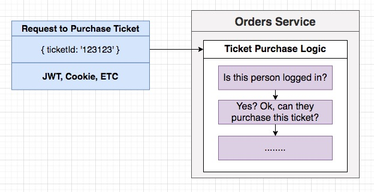
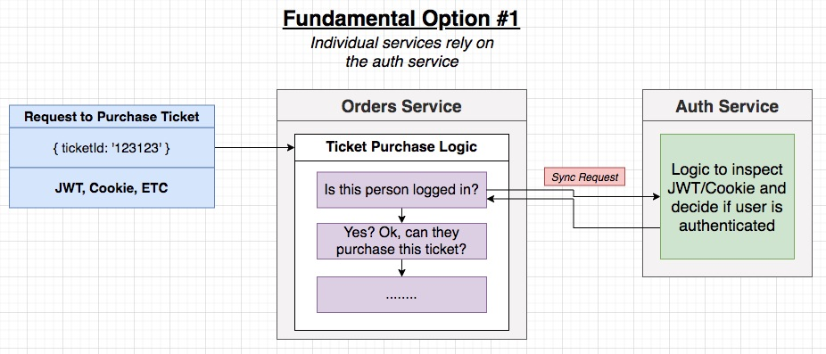
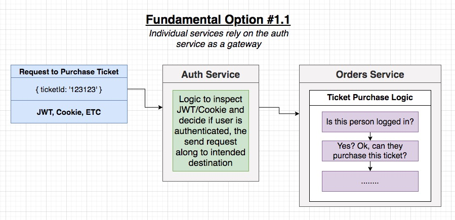
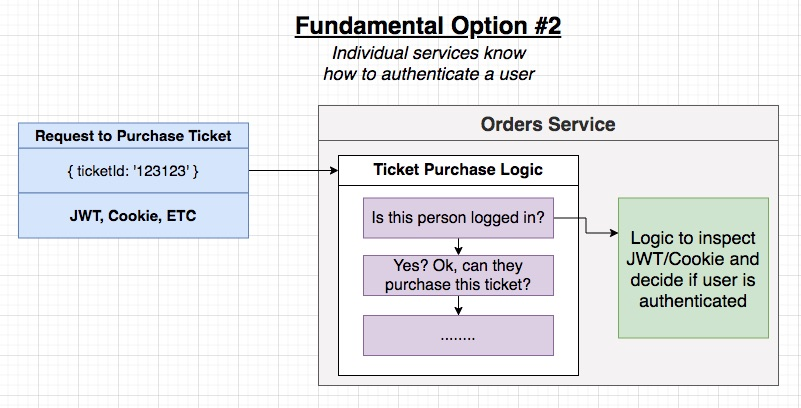

**[⬆ back to top](#table-of-contents)**

### Huge Issues with Authentication Strategies

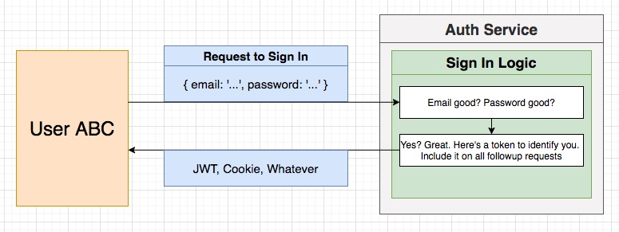

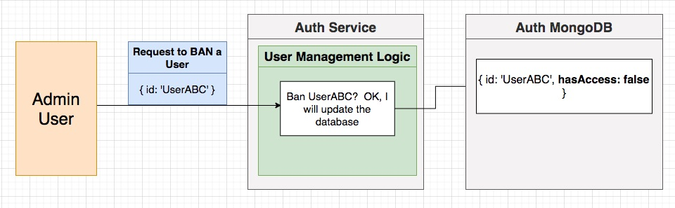


**[⬆ back to top](#table-of-contents)**

### So Which Option?

Fundamental Option #1

- Individual services rely on the auth service
- Changes to auth state are immediately reflected
- Auth service goes down?  Entire app is broken

Fundamental Option #2

- Individual services know how to authenticate a user
- Auth service is down? Who cares!
- Some user got banned? Darn, I just gave them the keys to my car 5 minutes ago...

We are going with Option #2 to stick with the idea of independent services

**[⬆ back to top](#table-of-contents)**

### Solving Issues with Option #2

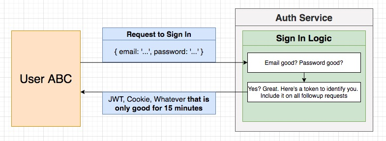
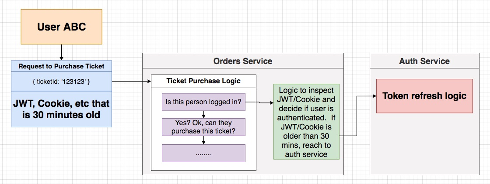
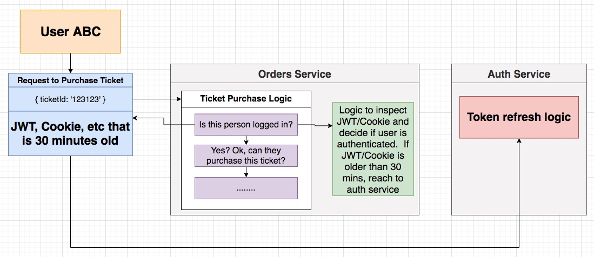
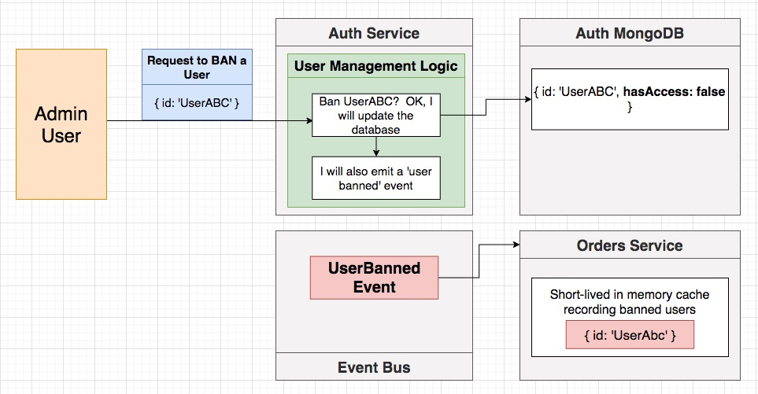

**[⬆ back to top](#table-of-contents)**

### Reminder on Cookies vs JWT's


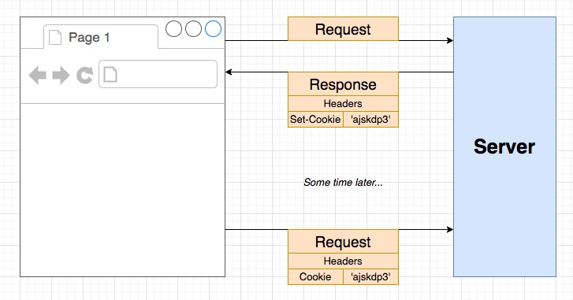
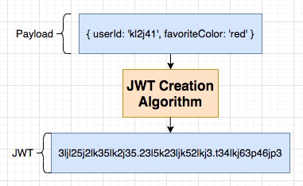

| Cookies                                           | JWT's                                  |
| ------------------------------------------------- | -------------------------------------- |
| Transport mechanism                               | Authentication/Authorization mechanism |
| Moves any kind of data between browser and server | Stores any data we want                |
| Automatically managed by the browser              | We have to manage it manually          |

**[⬆ back to top](#table-of-contents)**

### Microservices Auth Requirements

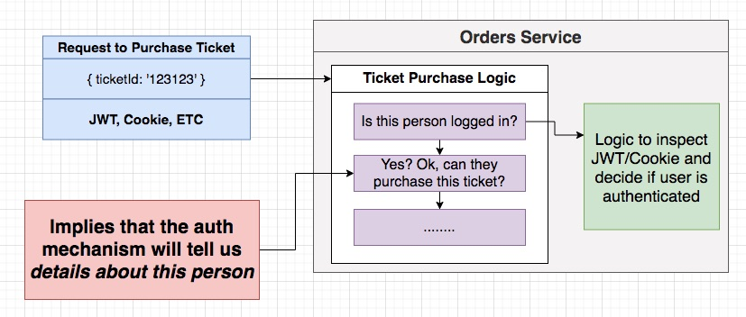

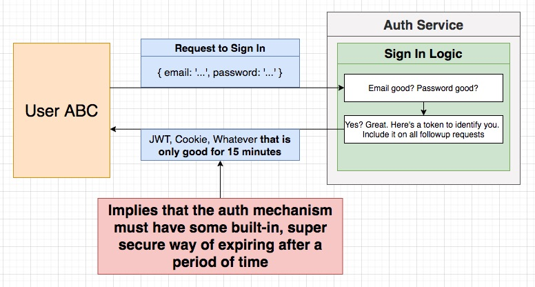
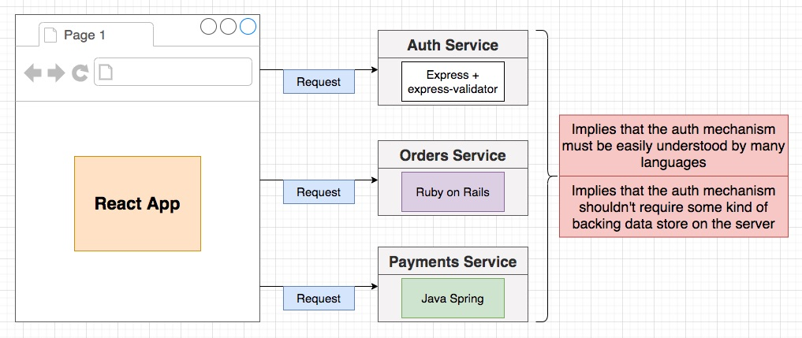

Requirements for Our Auth Mechanism -> JWT

- Must be able to tell us details about a user
- Must be able to handle authorization info
- Must have a built-in, tamper-resistant way to expire or - invalidate itself
- Must be easily understood between different languages
- Must not require some kind of backing data store on the server

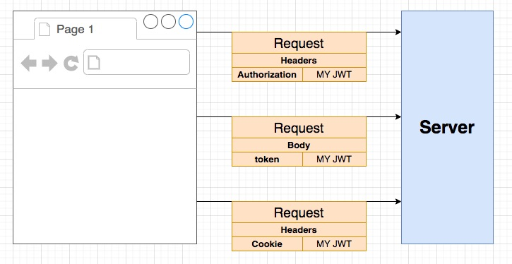

**[⬆ back to top](#table-of-contents)**

### Issues with JWT's and Server Side Rendering

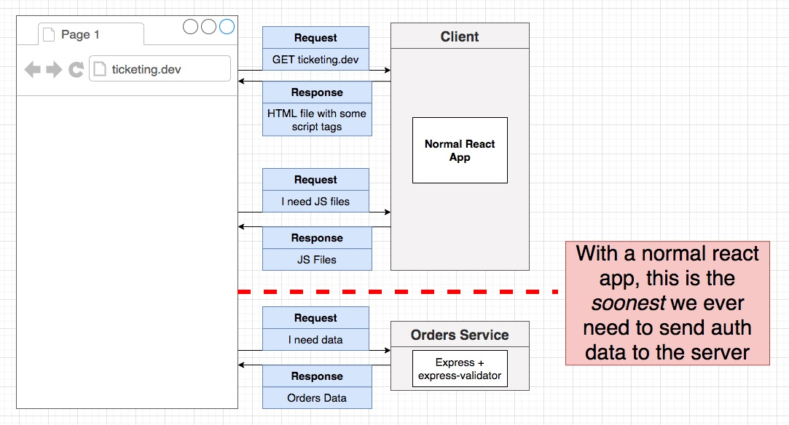
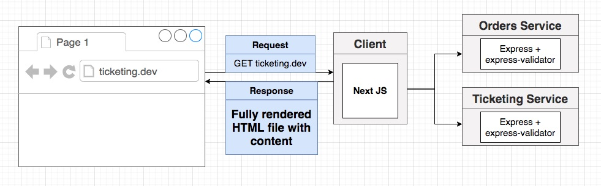

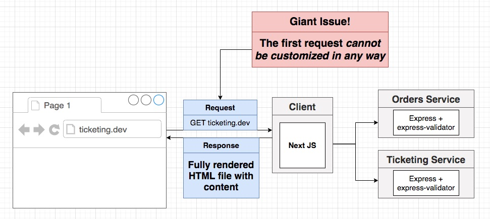
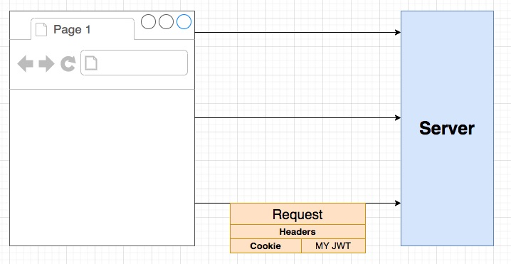

**[⬆ back to top](#table-of-contents)**

### Cookies and Encryption


Requirements for Our Auth Mechanism

- Must be able to tell us details about a user
- Must be able to handle authorization info
- Must have a built-in, tamper-resistant way to expire or - invalidate itself
- Must be easily understood between different languages
  - Cookie handling across languages is usually an issue when we encrypt the data in the cookie
  - We will not encrypt the cookie contents.
  - Remember, JWT's are tamper resistant
  - You can encrypt the cookie contents if this is a big deal to you
- Must not require some kind of backing data store on the server

**[⬆ back to top](#table-of-contents)**

### Adding Session Support

[cookie-session](https://github.com/expressjs/cookie-session)

```typescript
// index.ts
app.set('trust proxy', true);
app.use(json());
app.use(
  cookieSession({
    signed: false,
    secure: true
  })
);
```

**[⬆ back to top](#table-of-contents)**

### Note on Cookie-Session - Do Not Skip

The latest version of the @types/cookie-session package has a bug in it! Yes, a real bug - the type defs written out incorrectly describes the session object.

To fix this, we'll use a slightly earlier version of the package until this bug gets fixed.

Run the following inside the auth project:

```console
npm uninstall @types/cookie-session
npm install --save-exact @types/cookie-session@2.0.39
```

**[⬆ back to top](#table-of-contents)**

### Generating a JWT

[jsonwebtoken](https://github.com/auth0/node-jsonwebtoken)

```typescript
// signup.ts
// Generate JWT
const userJwt = jwt.sign(
  {
    id: user.id,
    email: user.email
  },
  'asdf'
);

// Store it on session object
req.session = {
  jwt: userJwt
};
```

**[⬆ back to top](#table-of-contents)**

### JWT Signing Keys

[BASE64 Decode](https://www.base64decode.org/)
[JWT](https://jwt.io/)

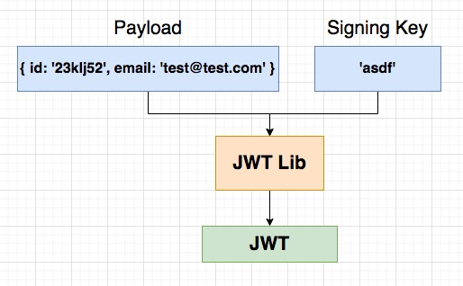
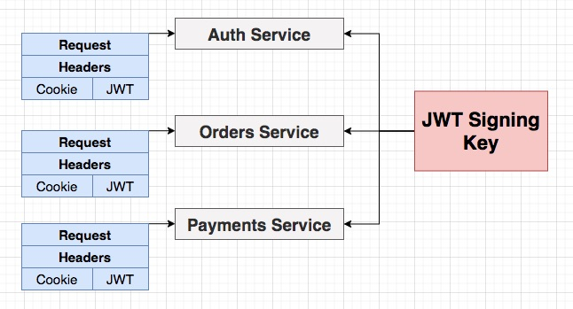

**[⬆ back to top](#table-of-contents)**

### Securely Storing Secrets with Kubernetes


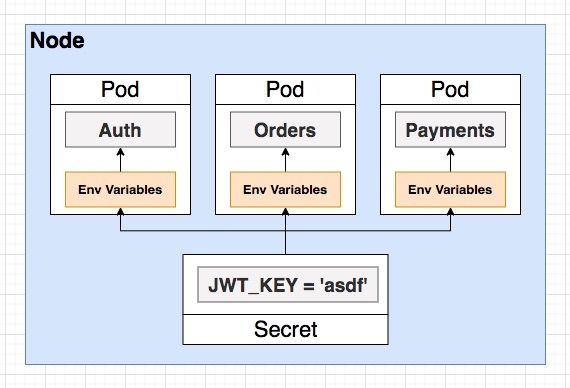

**[⬆ back to top](#table-of-contents)**

### Creating and Accessing Secrets

Creating a Secret

```console
kubectl create secret generic jwt-secret --from-literal=JWT_KEY=asdf
kubectl get secrets
kubectl describe secret jwt-secret
```

**[⬆ back to top](#table-of-contents)**

### Accessing Env Variables in a Pod

```typescript
if(!process.env.JWT_KEY) {
  throw new Error('JWT_KEY must be defined');
}
```

**[⬆ back to top](#table-of-contents)**

### Common Response Properties


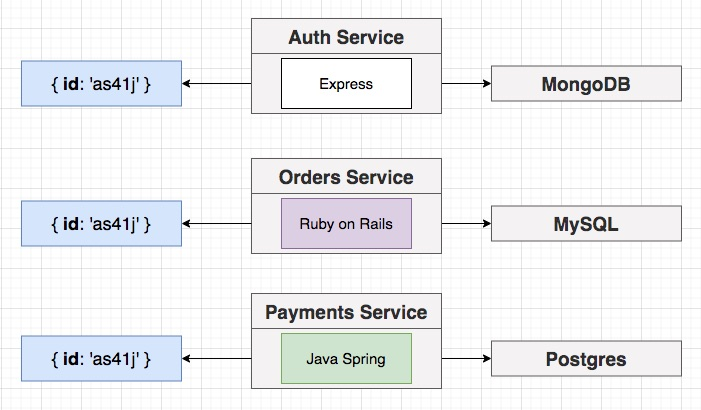

**[⬆ back to top](#table-of-contents)**

### Formatting JSON Properties

```typescript
const person = { name: 'alex' };
JSON.stringify(person)

const personTwo = { 
  name: 'alex', 
  toJSON() { return 1; } 
};
JSON.stringify(personTwo)
```

```typescript
const userSchema = new mongoose.Schema({
  email: {
    type: String,
    required: true
  },
  password: {
    type: String,
    required: true
  }
}, {
  toJSON: {
    transform(doc, ret) {
      ret.id = ret._id;
      delete ret._id;
      delete ret.password;
      delete ret.__v;
    }
  }
});
```

**[⬆ back to top](#table-of-contents)**

### The Signin Flow

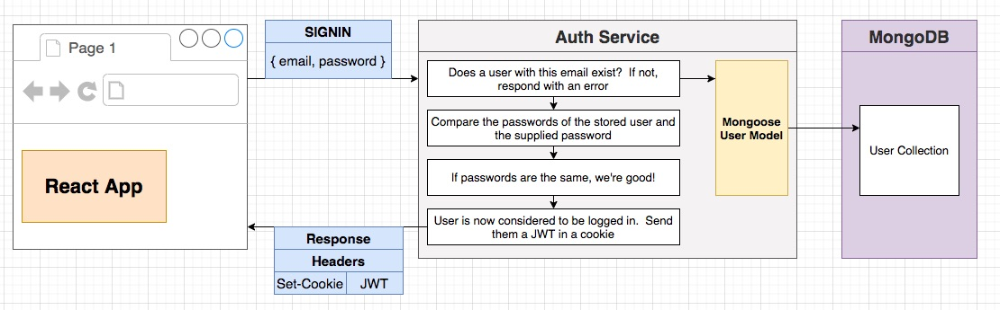

```typescript
import express, { Request, Response } from 'express';
import { body, validationResult } from 'express-validator';

import { RequestValidationError } from '../errors/request-validation-error';

const router = express.Router();

router.post(
  '/api/users/signin',
  [
    body('email')
      .isEmail()
      .withMessage('Email must be valid'),
    body('password')
      .trim()
      .notEmpty()
      .withMessage('You must supply a password')
  ],
  (req: Request, res: Response) => {
    const errors = validationResult(req);

    if (!errors.isEmpty()) {
      throw new RequestValidationError(errors.array());
    }
  }
);

export { router as signinRouter };
```

**[⬆ back to top](#table-of-contents)**

### Common Request Validation Middleware

```typescript
// validate-request.ts
import { Request, Response, NextFunction } from 'express';
import { validationResult } from 'express-validator';
import { RequestValidationError } from '../errors/request-validation-error';

export const validateRequest = (
  req: Request,
  res: Response,
  next: NextFunction
) => {
  const errors = validationResult(req);

  if (!errors.isEmpty()) {
    throw new RequestValidationError(errors.array());
  }

  next();
};
```

```typescript
// signin.ts
import express, { Request, Response } from 'express';
import { body } from 'express-validator';

import { validateRequest } from '../middleware/validate-request';

const router = express.Router();

router.post(
  '/api/users/signin',
  [
    body('email')
      .isEmail()
      .withMessage('Email must be valid'),
    body('password')
      .trim()
      .notEmpty()
      .withMessage('You must supply a password')
  ],
  validateRequest,
  (req: Request, res: Response) => {

  }
);

export { router as signinRouter };
```

**[⬆ back to top](#table-of-contents)**

### Sign In Logic


```typescript
import express, { Request, Response } from 'express';
import { body } from 'express-validator';
import jwt from 'jsonwebtoken';

import { Password } from '../services/password';
import { User } from '../models/user';
import { validateRequest } from '../middlewares/validate-request';
import { BadRequestError } from '../errors/bad-request-error';

const router = express.Router();

router.post(
  '/api/users/signin',
  [
    body('email')
      .isEmail()
      .withMessage('Email must be valid'),
    body('password')
      .trim()
      .notEmpty()
      .withMessage('You must supply a password')
  ],
  validateRequest,
  async (req: Request, res: Response) => {
    const { email, password } = req.body;

    const existingUser = await User.findOne({ email });
    if (!existingUser) {
      throw new BadRequestError('Invalid credentials');
    }

    const passwordsMatch = await Password.compare(
      existingUser.password,
      password
    );
    if (!passwordsMatch) {
      throw new BadRequestError('Invalid Credentials');
    }

    // Generate JWT
    const userJwt = jwt.sign(
      {
        id: existingUser.id,
        email: existingUser.email
      },
      process.env.JWT_KEY!
    );

    // Store it on session object
    req.session = {
      jwt: userJwt
    };

    res.status(200).send(existingUser);
  }
);

export { router as signinRouter };
```

**[⬆ back to top](#table-of-contents)**

### Current User Handler

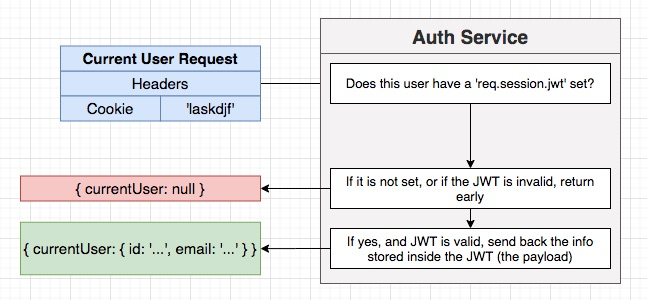

**[⬆ back to top](#table-of-contents)**

### Returning the Current User

```typescript
import express from 'express';
import jwt from 'jsonwebtoken';

const router = express.Router();

router.get('/api/users/currentuser', (req, res) => {
  if (!req.session?.jwt) {
    return res.send({ currentUser: null });
  }

  try {
    const payload = jwt.verify(
      req.session.jwt, 
      process.env.JWT_KEY!
    );
    res.send({ currentUser: payload });
  } catch (err) {
    res.send({ currentUser: null });
  }
});

export { router as currentUserRouter };
```

**[⬆ back to top](#table-of-contents)**

### Signing Out

```typescript
import express from 'express';

const router = express.Router();

router.post('/api/users/signout', (req, res) => {
  req.session = null;

  res.send({});
});

export { router as signoutRouter };
```

**[⬆ back to top](#table-of-contents)**

### Creating a Current User Middleware

```typescript
// current-user.ts
import { Request, Response, NextFunction } from 'express';
import jwt from 'jsonwebtoken';

export const currentUser = (
  req: Request,
  res: Response,
  next: NextFunction
) => {
  if (!req.session?.jwt) {
    return next();
  }

  try {
    const payload = jwt.verify(req.session.jwt, process.env.JWT_KEY!);
    req.currentUser = payload;
  } catch (err) {}

  next();
};
```

**[⬆ back to top](#table-of-contents)**

### Augmenting Type Definitions

```typescript
import { Request, Response, NextFunction } from 'express';
import jwt from 'jsonwebtoken';

interface UserPayload {
  id: string;
  email: string;
}

declare global {
  namespace Express {
    interface Request {
      currentUser?: UserPayload;
    }
  }
}

export const currentUser = (
  req: Request,
  res: Response,
  next: NextFunction
) => {
  if (!req.session?.jwt) {
    return next();
  }

  try {
    const payload = jwt.verify(
      req.session.jwt,
      process.env.JWT_KEY!
    ) as UserPayload;
    req.currentUser = payload;
  } catch (err) {}

  next();
};
```

```typescript
import express from 'express';
import jwt from 'jsonwebtoken';

import { currentUser } from '../middlewares/current-user';

const router = express.Router();

router.get('/api/users/currentuser', currentUser, (req, res) => {
  res.send({ currentUser: req.currentUser || null });
});

export { router as currentUserRouter };
```

**[⬆ back to top](#table-of-contents)**

### Requiring Auth for Route Access

```typescript
import { CustomError } from './custom-error';

export class NotAuthorizedError extends CustomError {
  statusCode = 401;

  constructor() {
    super('Not Authorized');

    Object.setPrototypeOf(this, NotAuthorizedError.prototype);
  }

  serializeErrors() {
    return [{ message: 'Not authorized' }];
  }
}
```

```typescript
import { Request, Response, NextFunction } from 'express';
import { NotAuthorizedError } from '../errors/not-authorized-error';

export const requireAuth = (
  req: Request,
  res: Response,
  next: NextFunction
) => {
  if (!req.currentUser) {
    throw new NotAuthorizedError();
  }

  next();
};
```

```typescript
import express from 'express';
import jwt from 'jsonwebtoken';

import { currentUser } from '../middlewares/current-user';
import { requireAuth } from '../middlewares/require-auth';

const router = express.Router();

router.get(
  '/api/users/currentuser', 
  currentUser, 
  requireAuth, 
  (req, res) => {
    res.send({ currentUser: req.currentUser || null });
  });

export { router as currentUserRouter };
```

**[⬆ back to top](#table-of-contents)**