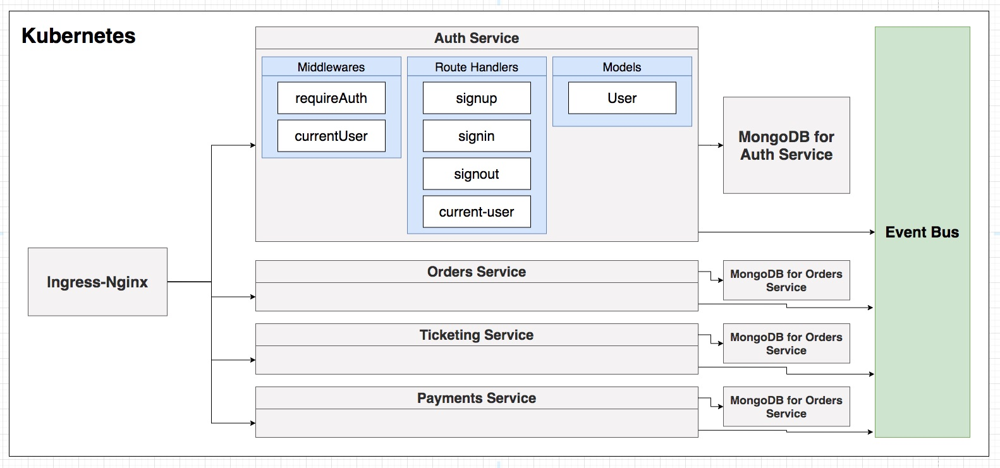
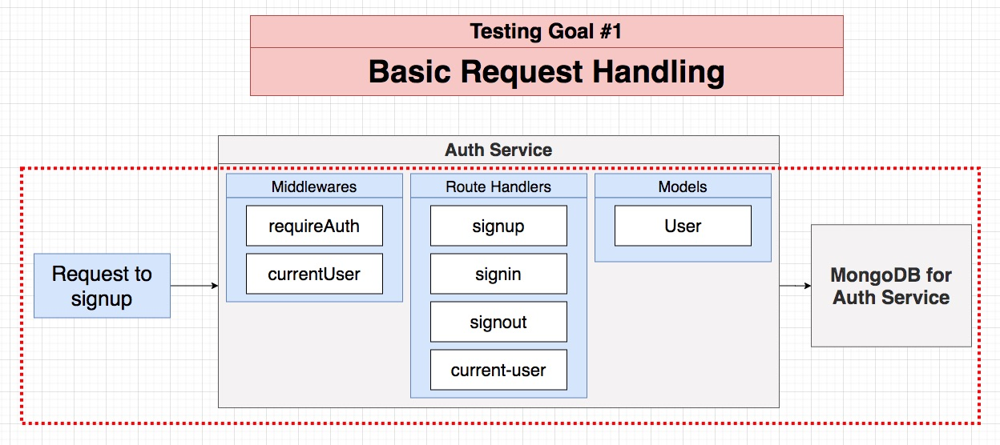
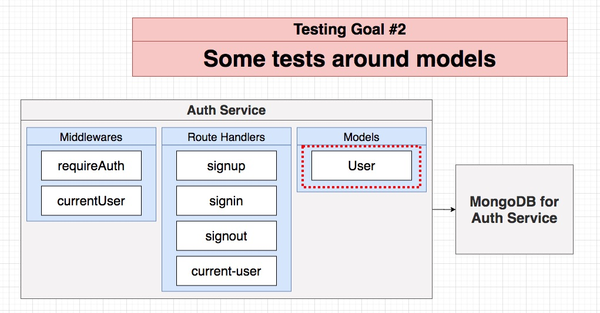
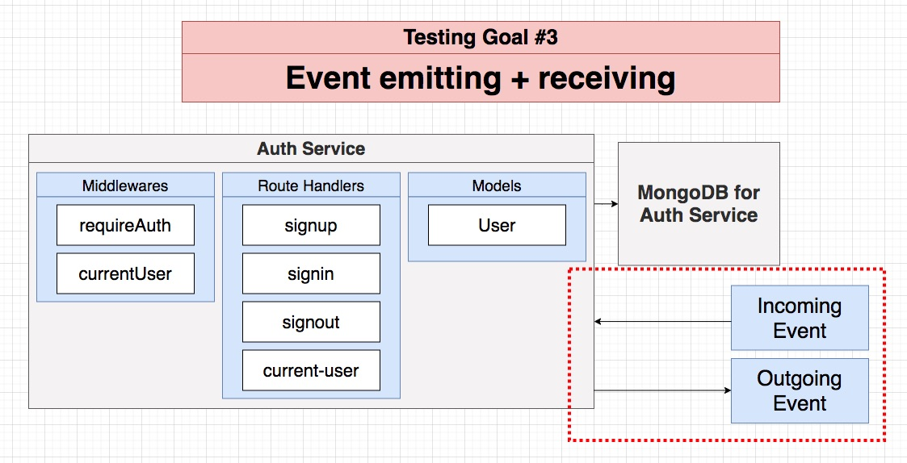
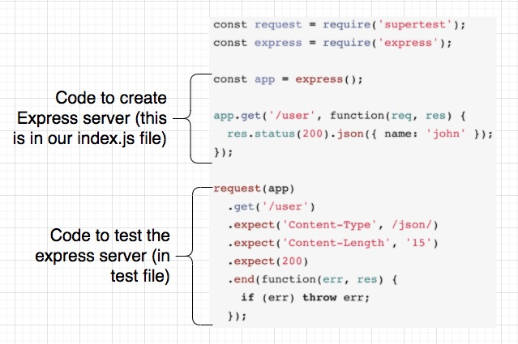
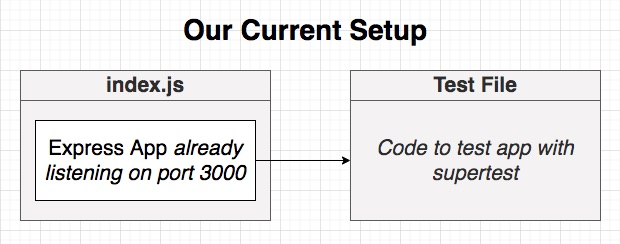
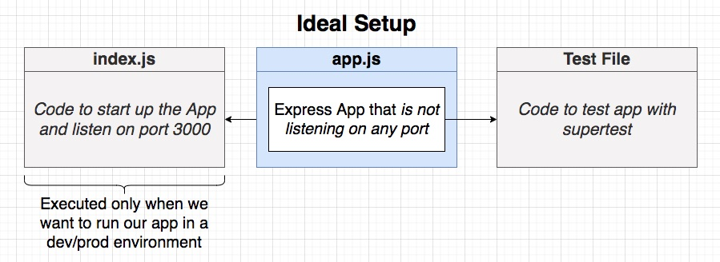

## **Section 10: Testing Isolated Microservices**

## Table of Contents
- [**Section 10: Testing Isolated Microservices**](#section-10-testing-isolated-microservices)
- [Table of Contents](#table-of-contents)
  - [Scope of Testing](#scope-of-testing)
  - [Testing Goals](#testing-goals)
  - [Testing Architecture](#testing-architecture)
  - [Index to App Refactor](#index-to-app-refactor)
  - [A Few Dependencies](#a-few-dependencies)
  - [Test Environment Setup](#test-environment-setup)
  - [Our First Test](#our-first-test)
  - [Testing Invalid Input](#testing-invalid-input)
  - [Requiring Unique Emails](#requiring-unique-emails)
  - [Changing Node Env During Tests](#changing-node-env-during-tests)
  - [Tests Around Sign In Functionality](#tests-around-sign-in-functionality)
  - [Testing Sign Out](#testing-sign-out)
  - [Issues with Cookies During Testing](#issues-with-cookies-during-testing)
  - [Easy Auth Solution](#easy-auth-solution)
  - [Auth Helper Function](#auth-helper-function)
  - [Testing Non-Authed Requests](#testing-non-authed-requests)

### Scope of Testing

| Whats the scope of our tests?                   | Example                                                                           |
| ----------------------------------------------- | --------------------------------------------------------------------------------- |
| Test a single piece of code in isolation        | Single middleware                                                                 |
| Test how different pieces of code work together | Request flowing through multiple middlewares to a request handler                 |
| Test how different components work together     | Make request to service, ensure write to database was completed                   |
| Test how different services work together       | Creating a 'payment' at the 'payments' service should affect the 'orders' service |



**[⬆ back to top](#table-of-contents)**

### Testing Goals





How will we run these tests?

- We are going to run these tests directly from our terminal without using docker
- This implies that our local environment is capable of running each service!
- Simple enough now, but more complex projects might make this hard!

**[⬆ back to top](#table-of-contents)**

### Testing Architecture






**[⬆ back to top](#table-of-contents)**

### Index to App Refactor

```typescript
// app.ts
import express from 'express';
import 'express-async-errors';
import { json } from 'body-parser';
import cookieSession from 'cookie-session';

import { currentUserRouter } from './routes/current-user';
import { signinRouter } from './routes/signin';
import { signoutRouter } from './routes/signout';
import { signupRouter } from './routes/signup';
import { errorHandler } from './middlewares/error-handler';
import { NotFoundError } from './errors/not-found-error';

const app = express();
app.set('trust proxy', true);
app.use(json());
app.use(
  cookieSession({
    signed: false,
    secure: true
  })
);

app.use(currentUserRouter);
app.use(signinRouter);
app.use(signoutRouter);
app.use(signupRouter);

app.all('*', async (req, res) => {
  throw new NotFoundError();
});

app.use(errorHandler);

export { app };
```

```typescript
// index.ts
import mongoose from 'mongoose';

import { app } from './app';

const start = async () => {
  if(!process.env.JWT_KEY) {
    throw new Error('JWT_KEY must be defined');
  }

  try {
    await mongoose.connect('mongodb://auth-mongo-srv:27017/auth', {
      useNewUrlParser: true,
      useUnifiedTopology: true,
      useCreateIndex: true
    });
    console.log('Connected to MongoDb');
  } catch (err) {
    console.log(err);
  }

  app.listen(3000, () => {
    console.log('Listening on port 3000!');
  });
};

start();
```

**[⬆ back to top](#table-of-contents)**

### A Few Dependencies

[jest](https://jestjs.io/en/)
[supertest](https://github.com/visionmedia/supertest)
[mongodb-memory-server](https://github.com/nodkz/mongodb-memory-server)

**[⬆ back to top](#table-of-contents)**

### Test Environment Setup

```typescript
import { MongoMemoryServer } from 'mongodb-memory-server';
import mongoose from 'mongoose';
import { app } from '../app';

let mongo: any;
beforeAll(async () => {
  process.env.JWT_KEY = 'asdfasdf';

  mongo = new MongoMemoryServer();
  const mongoUri = await mongo.getUri();

  await mongoose.connect(mongoUri, {
    useNewUrlParser: true,
    useUnifiedTopology: true
  });
});

beforeEach(async () => {
  const collections = await mongoose.connection.db.collections();

  for (let collection of collections) {
    await collection.deleteMany({});
  }
});

afterAll(async () => {
  await mongo.stop();
  await mongoose.connection.close();
});
```
**[⬆ back to top](#table-of-contents)**

### Our First Test

```typescript
// signup.test.ts
import request from 'supertest';
import { app } from '../../app';

it('returns a 201 on successful signup', async () => {
  return request(app)
    .post('/api/users/signup')
    .send({
      email: 'test@test.com',
      password: 'password'
    })
    .expect(201);
});
```

**[⬆ back to top](#table-of-contents)**

### Testing Invalid Input

```typescript
// signup.test.ts
import request from 'supertest';
import { app } from '../../app';

it('returns a 400 with an invalid email', async () => {
  return request(app)
    .post('/api/users/signup')
    .send({
      email: 'alskdflaskjfd',
      password: 'password'
    })
    .expect(400);
});

it('returns a 400 with an invalid password', async () => {
  return request(app)
    .post('/api/users/signup')
    .send({
      email: 'alskdflaskjfd',
      password: 'p'
    })
    .expect(400);
});

it('returns a 400 with missing email and password', async () => {
  await request(app)
    .post('/api/users/signup')
    .send({
      email: 'test@test.com'
    })
    .expect(400);

  await request(app)
    .post('/api/users/signup')
    .send({
      password: 'alskjdf'
    })
    .expect(400);
});
```

**[⬆ back to top](#table-of-contents)**

### Requiring Unique Emails

```typescript
// signup.test.ts
it('disallows duplicate emails', async () => {
  await request(app)
    .post('/api/users/signup')
    .send({
      email: 'test@test.com',
      password: 'password'
    })
    .expect(201);

  await request(app)
    .post('/api/users/signup')
    .send({
      email: 'test@test.com',
      password: 'password'
    })
    .expect(400);
});
```

**[⬆ back to top](#table-of-contents)**

### Changing Node Env During Tests

- cookie is set for https
- supertest is using http not https
- switch to http during test

```typescript
// signup.test.ts
it('sets a cookie after successful signup', async () => {
  const response = await request(app)
    .post('/api/users/signup')
    .send({
      email: 'test@test.com',
      password: 'password'
    })
    .expect(201);

  expect(response.get('Set-Cookie')).toBeDefined();
});
```

**[⬆ back to top](#table-of-contents)**

### Tests Around Sign In Functionality

```typescript
// signin.test.ts
import request from 'supertest';
import { app } from '../../app';

it('fails when a email that does not exist is supplied', async () => {
  await request(app)
    .post('/api/users/signin')
    .send({
      email: 'test@test.com',
      password: 'password'
    })
    .expect(400);
});

it('fails when an incorrect password is supplied', async () => {
  await request(app)
    .post('/api/users/signup')
    .send({
      email: 'test@test.com',
      password: 'password'
    })
    .expect(201);

  await request(app)
    .post('/api/users/signin')
    .send({
      email: 'test@test.com',
      password: 'aslkdfjalskdfj'
    })
    .expect(400);
});

it('responds with a cookie when given valid credentials', async () => {
  await request(app)
    .post('/api/users/signup')
    .send({
      email: 'test@test.com',
      password: 'password'
    })
    .expect(201);

  const response = await request(app)
    .post('/api/users/signin')
    .send({
      email: 'test@test.com',
      password: 'password'
    })
    .expect(200);

  expect(response.get('Set-Cookie')).toBeDefined();
});
```

**[⬆ back to top](#table-of-contents)**

### Testing Sign Out

```typescript
// signout.test.ts
import request from 'supertest';
import { app } from '../../app';

it('clears the cookie after signing out', async () => {
  await request(app)
    .post('/api/users/signup')
    .send({
      email: 'test@test.com',
      password: 'password'
    })
    .expect(201);

  const response = await request(app)
    .post('/api/users/signout')
    .send({})
    .expect(200);

  expect(response.get('Set-Cookie')[0]).toEqual(
    'express:sess=; path=/; expires=Thu, 01 Jan 1970 00:00:00 GMT; httponly'
  );
});
```

**[⬆ back to top](#table-of-contents)**

### Issues with Cookies During Testing

```typescript
// current-user.test.ts
import request from 'supertest';
import { app } from '../../app';

it('responds with details about the current user', async () => {
  await request(app)
    .post('/api/users/signup')
    .send({
      email: 'test@test.com',
      password: 'password'
    })
    .expect(201);

  const response = await request(app)
    .get('/api/users/currentuser')
    .send()
    .expect(200);

  console.log(response.body);
});
```

**[⬆ back to top](#table-of-contents)**

### Easy Auth Solution

```typescript
import request from 'supertest';
import { app } from '../../app';

it('responds with details about the current user', async () => {
  const authResponse = await request(app)
    .post('/api/users/signup')
    .send({
      email: 'test@test.com',
      password: 'password'
    })
    .expect(201);
  const cookie = authResponse.get('Set-Cookie');

  const response = await request(app)
    .get('/api/users/currentuser')
    .set('Cookie', cookie)
    .send()
    .expect(200);

  expect(response.body.currentUser.email).toEqual('test@test.com');
});
```

**[⬆ back to top](#table-of-contents)**

### Auth Helper Function

```typescript
global.signin = async () => {
  const email = 'test@test.com';
  const password = 'password';

  const response = await request(app)
    .post('/api/users/signup')
    .send({
      email,
      password
    })
    .expect(201);

  const cookie = response.get('Set-Cookie');

  return cookie;
};
```

**[⬆ back to top](#table-of-contents)**

### Testing Non-Authed Requests

```typescript
it('responds with null if not authenticated', async () => {
  const response = await request(app)
    .get('/api/users/currentuser')
    .send()
    .expect(200);

  expect(response.body.currentUser).toEqual(null);
});
```

**[⬆ back to top](#table-of-contents)**


