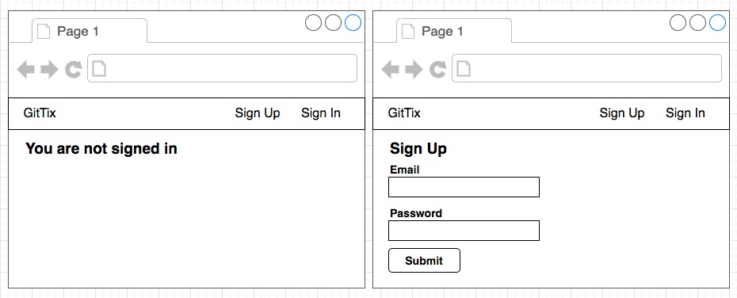
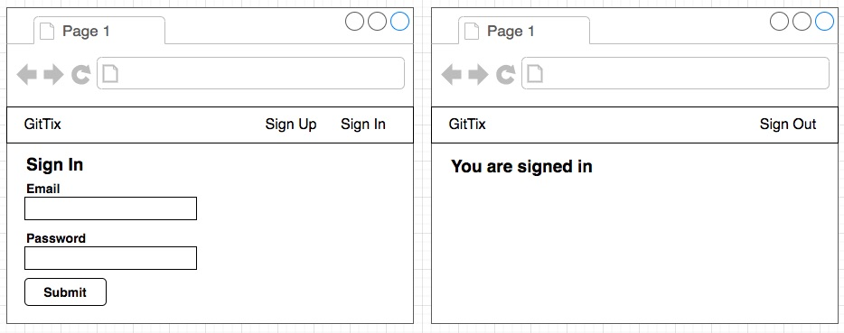
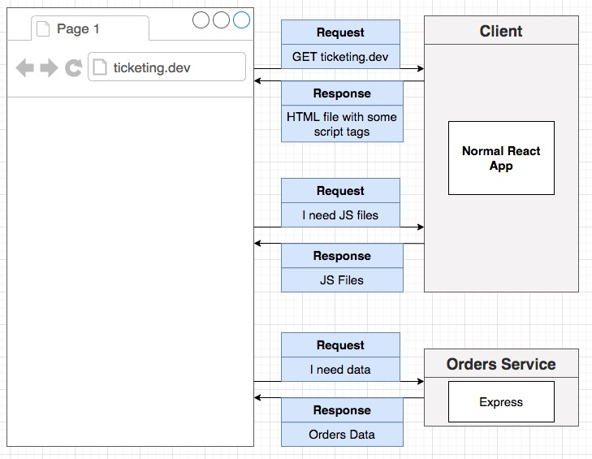
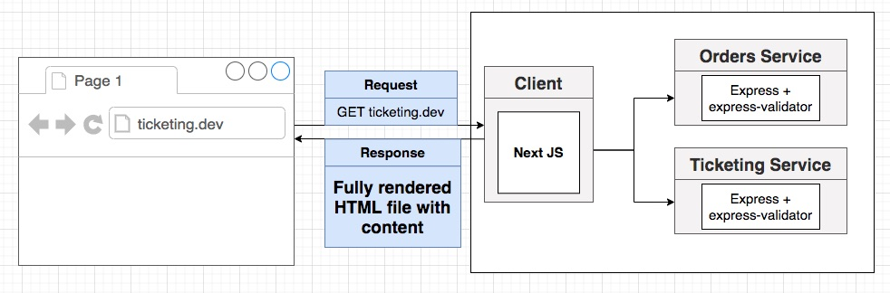

## **Section 11: Integrating a Server-Side-Rendered React App**

## Table of Contents
- [**Section 11: Integrating a Server-Side-Rendered React App**](#section-11-integrating-a-server-side-rendered-react-app)
- [Table of Contents](#table-of-contents)
  - [Starting the React App](#starting-the-react-app)
  - [Reminder on Server Side Rendering](#reminder-on-server-side-rendering)
  - [Basics of Next JS](#basics-of-next-js)
  - [Building a Next Image](#building-a-next-image)
  - [Running Next in Kubernetes](#running-next-in-kubernetes)
  - [Note on File Change Detection](#note-on-file-change-detection)
  - [Adding Global CSS](#adding-global-css)
  - [Adding a Sign Up Form](#adding-a-sign-up-form)
  - [Handling Email and Password Inputs](#handling-email-and-password-inputs)
  - [Successful Account Signup](#successful-account-signup)
  - [Handling Validation Errors](#handling-validation-errors)
  - [The useRequest Hook](#the-userequest-hook)
  - [Using the useRequest Hook](#using-the-userequest-hook)
  - [An onSuccess Callback](#an-onsuccess-callback)
  - [Overview on Server Side Rendering](#overview-on-server-side-rendering)
  - [Fetching Data During SSR](#fetching-data-during-ssr)
  - [Why the Error?](#why-the-error)
  - [Two Possible Solutions](#two-possible-solutions)
  - [Cross Namespace Service Communication](#cross-namespace-service-communication)
  - [When is GetInitialProps Called?](#when-is-getinitialprops-called)
  - [On the Server or the Browser](#on-the-server-or-the-browser)
  - [Specifying the Host](#specifying-the-host)
  - [Passing Through the Cookies](#passing-through-the-cookies)
  - [A Reusable API Client](#a-reusable-api-client)
  - [Content on the Landing Page](#content-on-the-landing-page)
  - [The Sign In Form](#the-sign-in-form)
  - [A Reusable Header](#a-reusable-header)
  - [Moving GetInitialProps](#moving-getinitialprops)
  - [Issues with Custom App GetInitialProps](#issues-with-custom-app-getinitialprops)
  - [Handling Multiple GetInitialProps](#handling-multiple-getinitialprops)
  - [Passing Props Through](#passing-props-through)
  - [Building the Header](#building-the-header)
  - [Conditionally Showing Links](#conditionally-showing-links)
  - [Signing Out](#signing-out)
  - [React App Catchup](#react-app-catchup)

### Starting the React App

**[⬆ back to top](#table-of-contents)**

### Reminder on Server Side Rendering

Client Side Rendering

Server Side Rendering

**[⬆ back to top](#table-of-contents)**

### Basics of Next JS

- install react, react-dom, next
- create pages folder and add page components
- npm run dev

**[⬆ back to top](#table-of-contents)**

### Building a Next Image
**[⬆ back to top](#table-of-contents)**

### Running Next in Kubernetes
**[⬆ back to top](#table-of-contents)**

### Note on File Change Detection
**[⬆ back to top](#table-of-contents)**

### Adding Global CSS
**[⬆ back to top](#table-of-contents)**

### Adding a Sign Up Form
**[⬆ back to top](#table-of-contents)**

### Handling Email and Password Inputs
**[⬆ back to top](#table-of-contents)**

### Successful Account Signup
**[⬆ back to top](#table-of-contents)**

### Handling Validation Errors
**[⬆ back to top](#table-of-contents)**

### The useRequest Hook
**[⬆ back to top](#table-of-contents)**

### Using the useRequest Hook
**[⬆ back to top](#table-of-contents)**

### An onSuccess Callback
**[⬆ back to top](#table-of-contents)**

### Overview on Server Side Rendering
**[⬆ back to top](#table-of-contents)**

### Fetching Data During SSR
**[⬆ back to top](#table-of-contents)**

### Why the Error?
**[⬆ back to top](#table-of-contents)**

### Two Possible Solutions
**[⬆ back to top](#table-of-contents)**

### Cross Namespace Service Communication
**[⬆ back to top](#table-of-contents)**

### When is GetInitialProps Called?
**[⬆ back to top](#table-of-contents)**

### On the Server or the Browser
**[⬆ back to top](#table-of-contents)**

### Specifying the Host
**[⬆ back to top](#table-of-contents)**

### Passing Through the Cookies
**[⬆ back to top](#table-of-contents)**

### A Reusable API Client
**[⬆ back to top](#table-of-contents)**

### Content on the Landing Page
**[⬆ back to top](#table-of-contents)**

### The Sign In Form
**[⬆ back to top](#table-of-contents)**

### A Reusable Header
**[⬆ back to top](#table-of-contents)**

### Moving GetInitialProps
**[⬆ back to top](#table-of-contents)**

### Issues with Custom App GetInitialProps
**[⬆ back to top](#table-of-contents)**

### Handling Multiple GetInitialProps
**[⬆ back to top](#table-of-contents)**

### Passing Props Through
**[⬆ back to top](#table-of-contents)**

### Building the Header
**[⬆ back to top](#table-of-contents)**

### Conditionally Showing Links
**[⬆ back to top](#table-of-contents)**

### Signing Out
**[⬆ back to top](#table-of-contents)**

### React App Catchup
**[⬆ back to top](#table-of-contents)**
