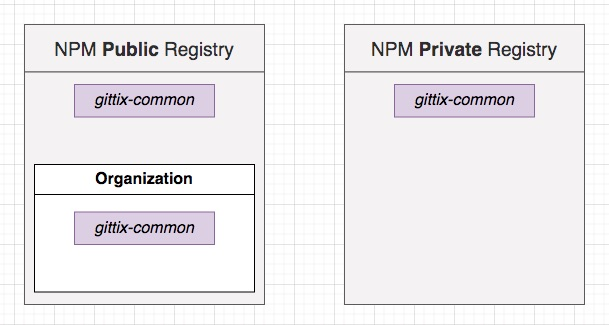

## **Section 12: Code Sharing and Reuse Between Services**

## Table of Contents
- [**Section 12: Code Sharing and Reuse Between Services**](#section-12-code-sharing-and-reuse-between-services)
- [Table of Contents](#table-of-contents)
  - [Shared Logic Between Services](#shared-logic-between-services)
  - [Options for Code Sharing](#options-for-code-sharing)
  - [NPM Organizations](#npm-organizations)
  - [Publishing NPM Modules](#publishing-npm-modules)
  - [Project Setup](#project-setup)
  - [An Easy Publish Command](#an-easy-publish-command)
  - [Relocating Shared Code](#relocating-shared-code)
  - [Updating Import Statements](#updating-import-statements)
  - [Updating the Common Module](#updating-the-common-module)

### Shared Logic Between Services

- What about event-related stuff for the auth service?
- It turns out that no other services really need to know about what the auth service is doing!
- Everything the auth service does is exposed through that JWT in the cookie


**[⬆ back to top](#table-of-contents)**

### Options for Code Sharing


Option #3 is selected

**[⬆ back to top](#table-of-contents)**

### NPM Organizations



- public organisation is selected
- Goto https://www.npmjs.com/
- create chticketing public organisation

**[⬆ back to top](#table-of-contents)**

### Publishing NPM Modules

```console
npm init -y
git init
git add .
git commit -m "initial commit"
npm login
npm publish --access public
```

**[⬆ back to top](#table-of-contents)**

### Project Setup

- There might be differences in our TS settings between the common lib and our services - don't want to deal with that
- Services might not be written with TS at all!
- Our common library will be written as Typescript and published as Javascript

```console
cd section-12/ticketing/common
tsc --init
```

**[⬆ back to top](#table-of-contents)**

### An Easy Publish Command

```console
git status
git add .
git commit -m "additional config"
npm version patch
npm run build
npm login
npm publish --access public
```

**[⬆ back to top](#table-of-contents)**

### Relocating Shared Code

- move errors and middlewares from auth services to common npm module
- install necessary libraries
```
npm i express express-validator cookie-session jsonwebtoken @types/cookie-session @types/express @types/jsonwebtoken
npm run pub
```

**[⬆ back to top](#table-of-contents)**

### Updating Import Statements

```console
npm i @chticketing/common
```

```typescript
import { errorHandler, NotFoundError } from '@chticketing/common';
```

**[⬆ back to top](#table-of-contents)**

### Updating the Common Module

```console
cd section-12/ticketing/common
npm run pub
cd ../auth
npm update @chticketing/common
```

```console
kubectl get pods
kubectl exec -it auth-depl-86c85d4895-n4bp4 sh
/app # cd node_modules/@chticketing/common
/app # cat package.json
```

**[⬆ back to top](#table-of-contents)**
