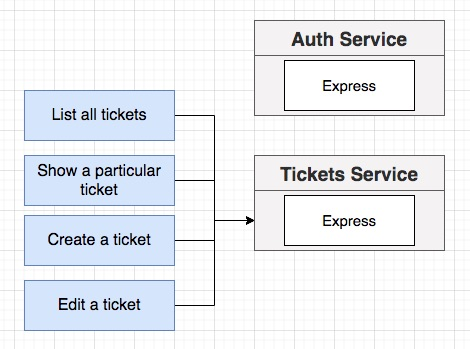
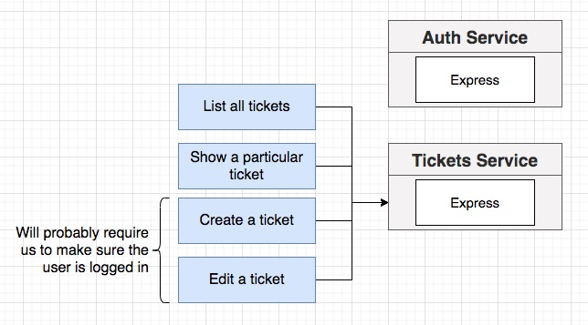
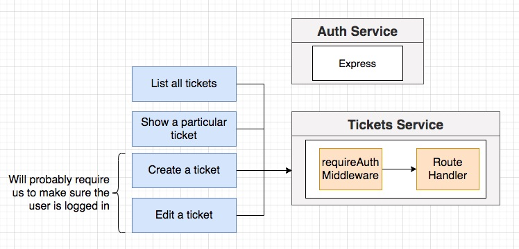
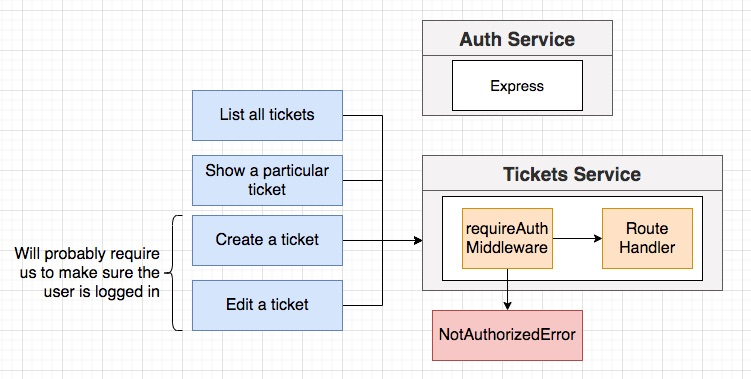
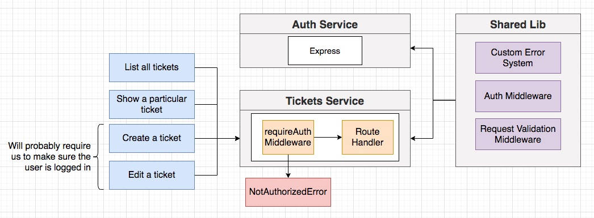
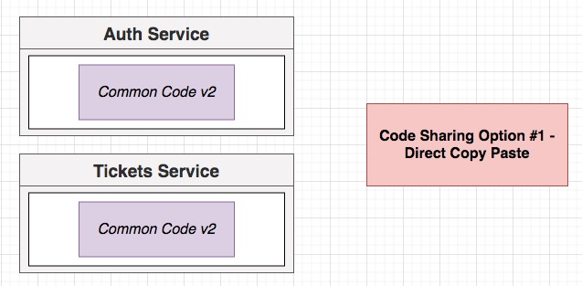
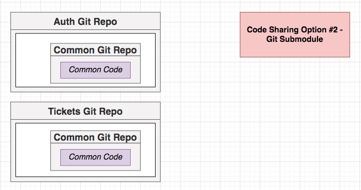
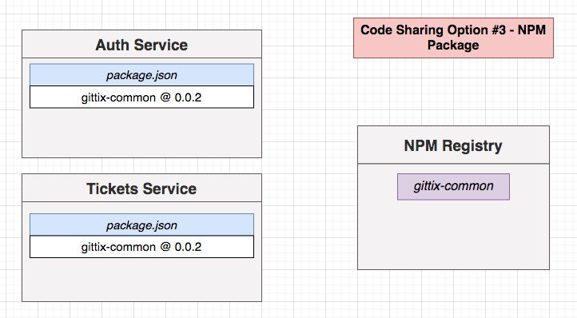

## **Section 12: Code Sharing and Reuse Between Services**

## Table of Contents
- [**Section 12: Code Sharing and Reuse Between Services**](#section-12-code-sharing-and-reuse-between-services)
- [Table of Contents](#table-of-contents)
  - [Shared Logic Between Services](#shared-logic-between-services)
  - [Options for Code Sharing](#options-for-code-sharing)
  - [NPM Organizations](#npm-organizations)
  - [Publishing NPM Modules](#publishing-npm-modules)
  - [Project Setup](#project-setup)
  - [An Easy Publish Command](#an-easy-publish-command)
  - [Relocating Shared Code](#relocating-shared-code)
  - [Updating Import Statements](#updating-import-statements)
  - [Updating the Common Module](#updating-the-common-module)

### Shared Logic Between Services

- What about event-related stuff for the auth service?
- It turns out that no other services really need to know about what the auth service is doing!
- Everything the auth service does is exposed through that JWT in the cookie

**[⬆ back to top](#table-of-contents)**

### Options for Code Sharing

Option #3 is selected

**[⬆ back to top](#table-of-contents)**

### NPM Organizations
**[⬆ back to top](#table-of-contents)**

### Publishing NPM Modules
**[⬆ back to top](#table-of-contents)**

### Project Setup
**[⬆ back to top](#table-of-contents)**

### An Easy Publish Command
**[⬆ back to top](#table-of-contents)**

### Relocating Shared Code
**[⬆ back to top](#table-of-contents)**

### Updating Import Statements
**[⬆ back to top](#table-of-contents)**

### Updating the Common Module
**[⬆ back to top](#table-of-contents)**
