## **Section 16: Managing a NATS Client**

## Table of Contents
- [**Section 16: Managing a NATS Client**](#section-16-managing-a-nats-client)
- [Table of Contents](#table-of-contents)
  - [Publishing Ticket Creation](#publishing-ticket-creation)
  - [More on Publishing](#more-on-publishing)
  - [NATS Client Singleton](#nats-client-singleton)
  - [Remember Mongoose?](#remember-mongoose)
  - [Singleton Implementation](#singleton-implementation)
  - [Accessing the NATS Client](#accessing-the-nats-client)
  - [Graceful Shutdown](#graceful-shutdown)
  - [Successful Listen!](#successful-listen)
  - [Ticket Update Publishing](#ticket-update-publishing)
  - [Failed Event Publishing](#failed-event-publishing)
  - [Handling Publish Failures](#handling-publish-failures)
  - [Fixing a Few Tests](#fixing-a-few-tests)
  - [Redirecting Imports](#redirecting-imports)
  - [Providing a Mock Implementation](#providing-a-mock-implementation)
  - [Test-Suite Wide Mocks](#test-suite-wide-mocks)
  - [Ensuring Mock Invocations](#ensuring-mock-invocations)
  - [NATS Env Variables](#nats-env-variables)

### Publishing Ticket Creation

```typescript
// ticket-created-publisher.ts
import { Publisher, Subjects, TicketCreatedEvent } from '@chticketing/common';

export class TicketCreatedPublisher extends Publisher<TicketCreatedEvent> {
  subject: Subjects.TicketCreated = Subjects.TicketCreated;
}
```

**[⬆ back to top](#table-of-contents)**

### More on Publishing

```typescript
// new.ts
await new TicketCreatedPublisher(client).publish({
  id: ticket.id,
  title: ticket.title,
  price: ticket.price,
  userId: ticket.userId,
});
```
**[⬆ back to top](#table-of-contents)**

### NATS Client Singleton

Cyclic Dependency Issue

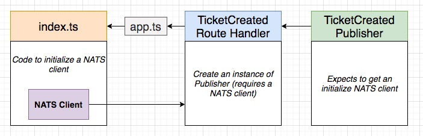
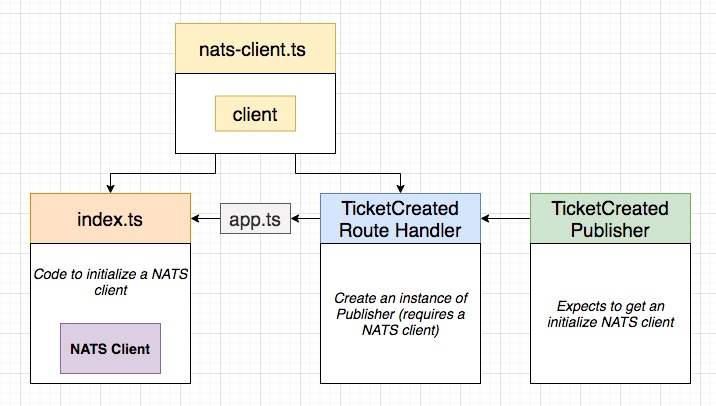

**[⬆ back to top](#table-of-contents)**

### Remember Mongoose?

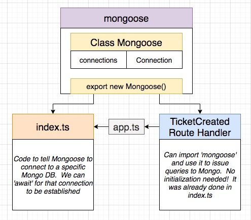
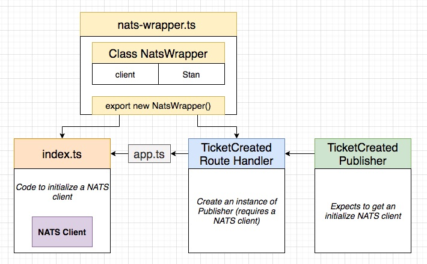

```typescript
// nats-wrapper.ts
import nats, { Stan } from 'node-nats-streaming';

class NatsWrapper {}

export const natsWrapper = new NatsWrapper();
```

**[⬆ back to top](#table-of-contents)**

### Singleton Implementation

```typescript
// nats-wrapper.ts
import nats, { Stan } from 'node-nats-streaming';

class NatsWrapper {
  private _client?: Stan;

  connect(clusterId: string, clientId: string, url: string) {
    this._client = nats.connect(clusterId, clientId, { url });

    return new Promise((resolve, reject) => {
      this._client!.on('connect', () => {
        console.log('Connected to NATS');
        resolve();
      });
      this._client!.on('error', (err) => {
        reject(err);
      });
    });
  }
}

export const natsWrapper = new NatsWrapper();
```

```typescript
  try {
    await natsWrapper.connect(
      'ticketing', 
      'dhghad', 
      'http://nats-srv:4222'
    );
  ...
  }
```

**[⬆ back to top](#table-of-contents)**

### Accessing the NATS Client

```typescript
// nats-wrapper.ts
import nats, { Stan } from 'node-nats-streaming';

class NatsWrapper {
  private _client?: Stan;

  get client() {
    if (!this._client) {
      throw new Error('Cannot access NAT client before connecting')
    }

    return this._client;
  }

  connect(clusterId: string, clientId: string, url: string) {
    this._client = nats.connect(clusterId, clientId, { url });

    return new Promise((resolve, reject) => {
      this.client.on('connect', () => {
        console.log('Connected to NATS');
        resolve();
      });
      this.client.on('error', (err) => {
        reject(err);
      });
    });
  }
}

export const natsWrapper = new NatsWrapper();
```

```typescript
// new.ts
import { natsWrapper } from'../nats-wrapper';

  await new TicketCreatedPublisher(natsWrapper.client).publish({
    id: ticket.id,
    title: ticket.title,
    price: ticket.price,
    userId: ticket.userId,
  });
```

**[⬆ back to top](#table-of-contents)**

### Graceful Shutdown

```typescript
// index.ts
  natsWrapper.client.on('close', () => {
    console.log('NATS connection closed!');
    process.exit();
  });
  process.on('SIGINT', () => natsWrapper.client.close());
  process.on('SIGTERM', () => natsWrapper.client.close());
```

```console
kubectl get pods
kubectl delete pod nats-depl-8658cfccf-r9bt8
```

**[⬆ back to top](#table-of-contents)**

### Successful Listen!

- Connected to NATS

```console
skaffold dev
kubectl get pods
kubectl port-forward nats-depl-8658cfccf-jnb7b 4222:4222
```

- Listener connected to NATS

```console
cd section-16/ticketing/nats-test
npm run listen
```

- Create Ticket with Postman
- Check listener receive the ticket created

**[⬆ back to top](#table-of-contents)**

### Ticket Update Publishing

```typescript
import { Publisher, Subjects, TicketUpdatedEvent } from '@chticketing/common';

export class TicketUpdatedPublisher extends Publisher<TicketUpdatedEvent> {
  subject: Subjects.TicketUpdated = Subjects.TicketUpdated;
}
```

```typescript
  new TicketUpdatedPublisher(natsWrapper.client).publish({
    id: ticket.id,
    title: ticket.title,
    price: ticket.price,
    userId: ticket.userId
  });
```

**[⬆ back to top](#table-of-contents)**

### Failed Event Publishing

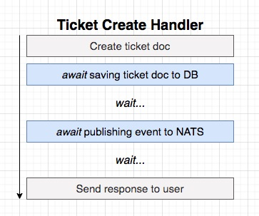
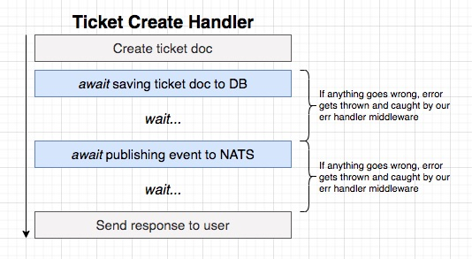
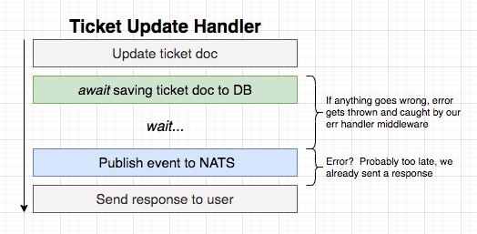

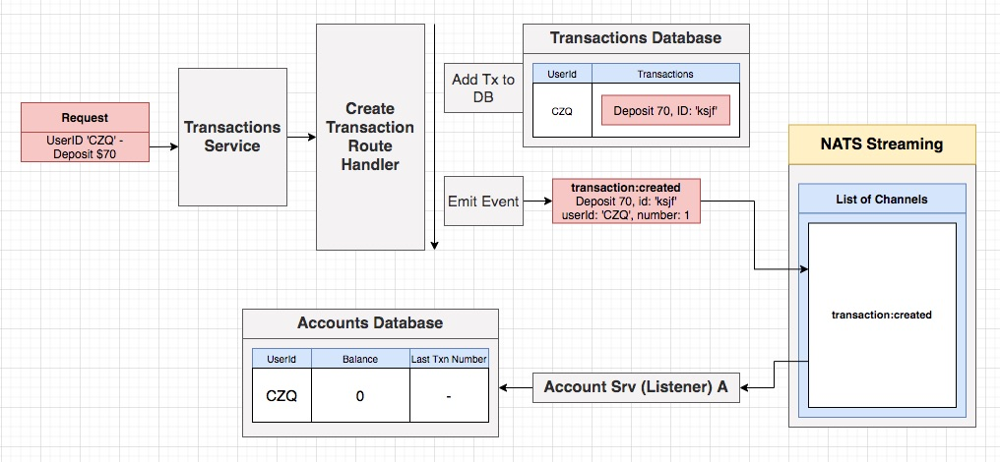
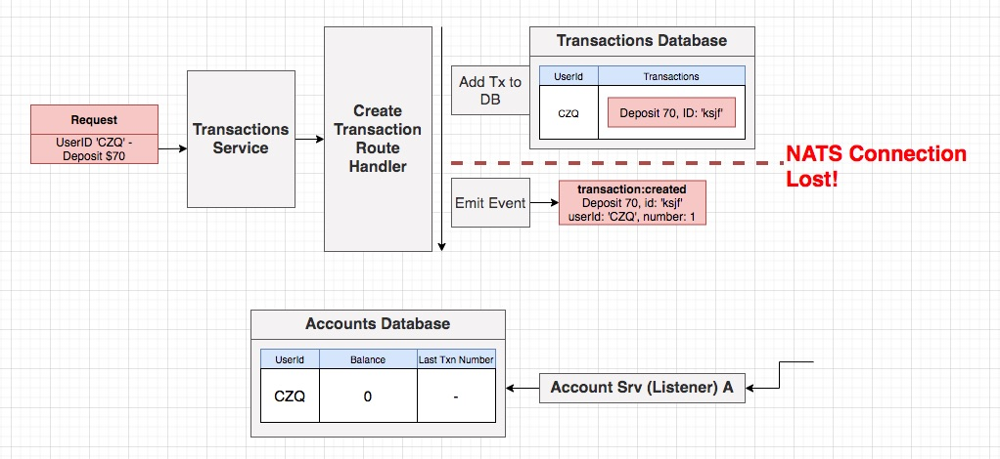

**[⬆ back to top](#table-of-contents)**

### Handling Publish Failures

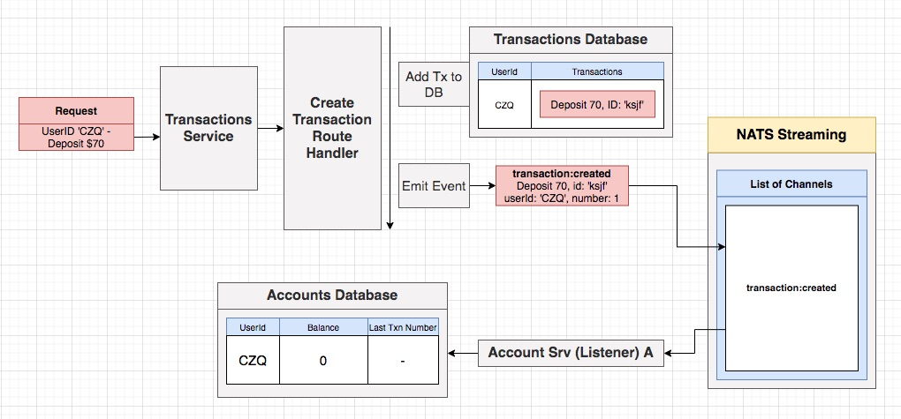

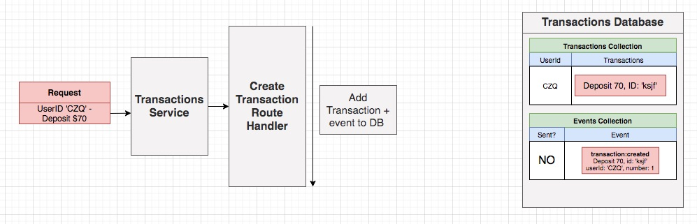
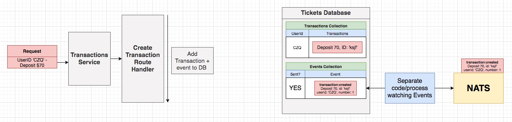
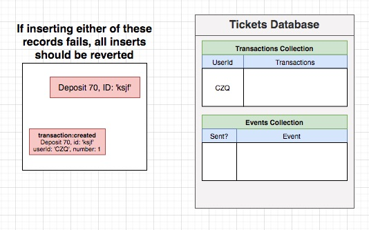
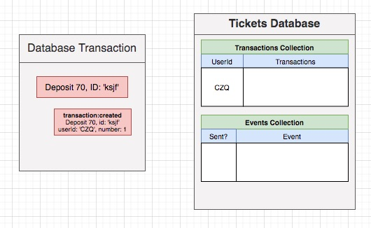

**[⬆ back to top](#table-of-contents)**

### Fixing a Few Tests

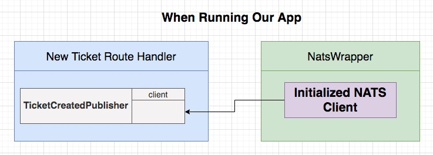
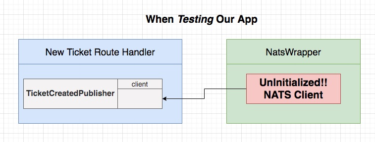
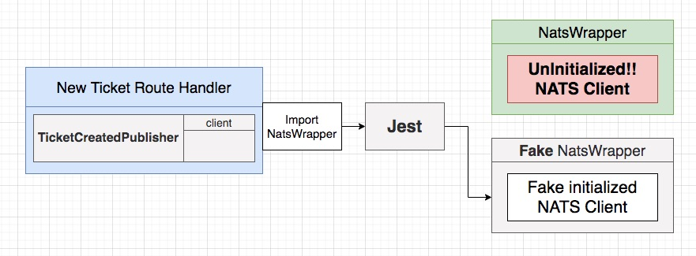

**[⬆ back to top](#table-of-contents)**

### Redirecting Imports

Mocking (Faking) Imports with Jest

- Find the file that we want to 'fake'
- In the same directory, create a folder called '__mocks__'
- In that folder, create a file with an identical name to the file we want to fake
- Write a fake implementation
- Tell jest to use that fake file in our test file
```typescript
jest.mock('../../nats-wrapper');
```

**[⬆ back to top](#table-of-contents)**

### Providing a Mock Implementation


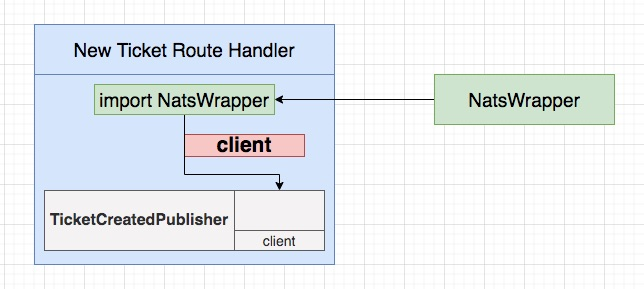
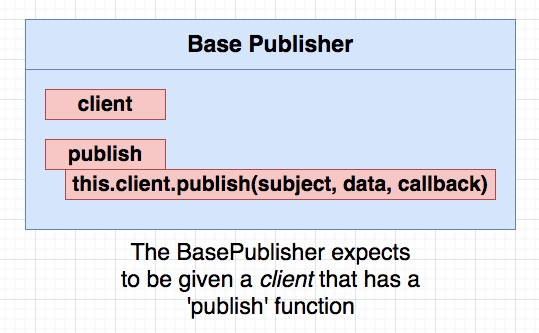

```typescript
export const natsWrapper = {
  client: {
    publish: (subject: string, data: string, callback: () => void) => {
      callback();
    },
  },
};
```

**[⬆ back to top](#table-of-contents)**

### Test-Suite Wide Mocks
**[⬆ back to top](#table-of-contents)**

### Ensuring Mock Invocations
**[⬆ back to top](#table-of-contents)**

### NATS Env Variables
**[⬆ back to top](#table-of-contents)**
