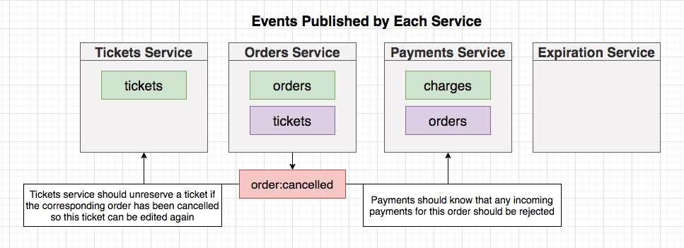

## **Section 18: Understanding Event Flow**

## Table of Contents
- [**Section 18: Understanding Event Flow**](#section-18-understanding-event-flow)
- [Table of Contents](#table-of-contents)
  - [Orders Service Events](#orders-service-events)
  - [Creating the Events](#creating-the-events)
  - [Implementing the Publishers](#implementing-the-publishers)
  - [Publishing the Order Creation](#publishing-the-order-creation)
  - [Publishing Order Cancellation](#publishing-order-cancellation)
  - [Testing Event Publishing](#testing-event-publishing)

### Orders Service Events




**[⬆ back to top](#table-of-contents)**

### Creating the Events

```typescript
import { Subjects } from './subjects';
import { OrderStatus } from './types/order-status';

export interface OrderCreatedEvent {
  subject: Subjects.OrderCreated;
  data: {
    id: string;
    status: OrderStatus;
    userId: string;
    expiresAt: string;
    ticket: {
      id: string;
      price: number;
    };
  };
}
```

```typescript
import { Subjects } from './subjects';

export interface OrderCancelledEvent {
  subject: Subjects.OrderCancelled;
  data: {
    id: string;
    ticket: {
      id: string;
    };
  };
}
```

**[⬆ back to top](#table-of-contents)**

### Implementing the Publishers
**[⬆ back to top](#table-of-contents)**

### Publishing the Order Creation
**[⬆ back to top](#table-of-contents)**

### Publishing Order Cancellation
**[⬆ back to top](#table-of-contents)**

### Testing Event Publishing
**[⬆ back to top](#table-of-contents)**