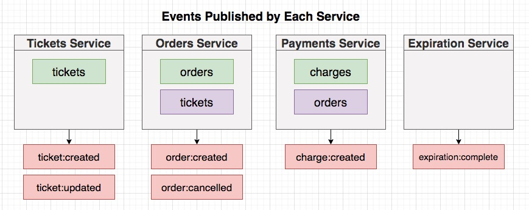
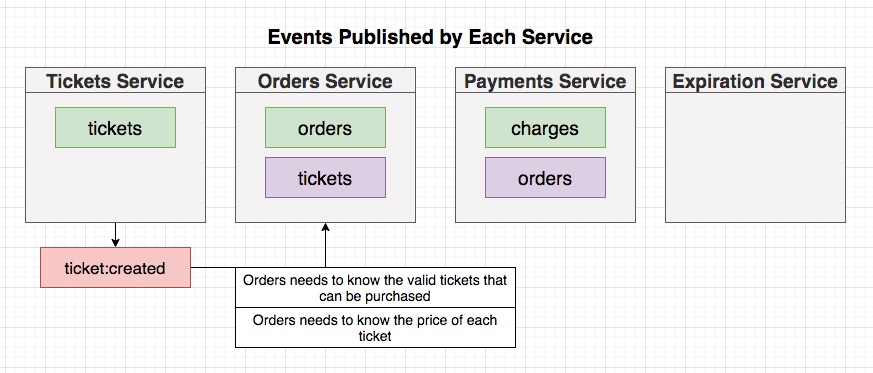
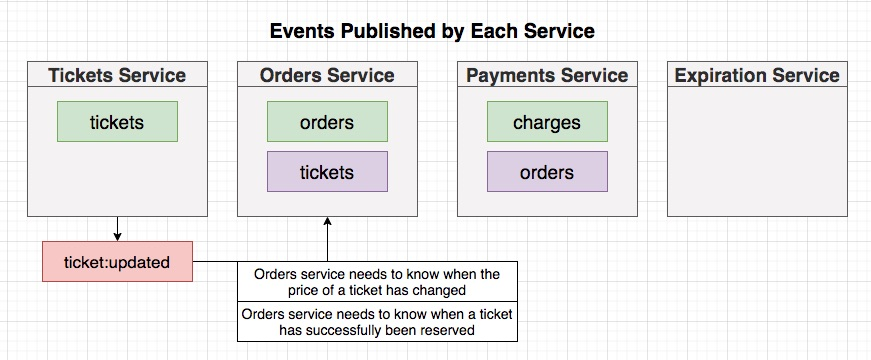
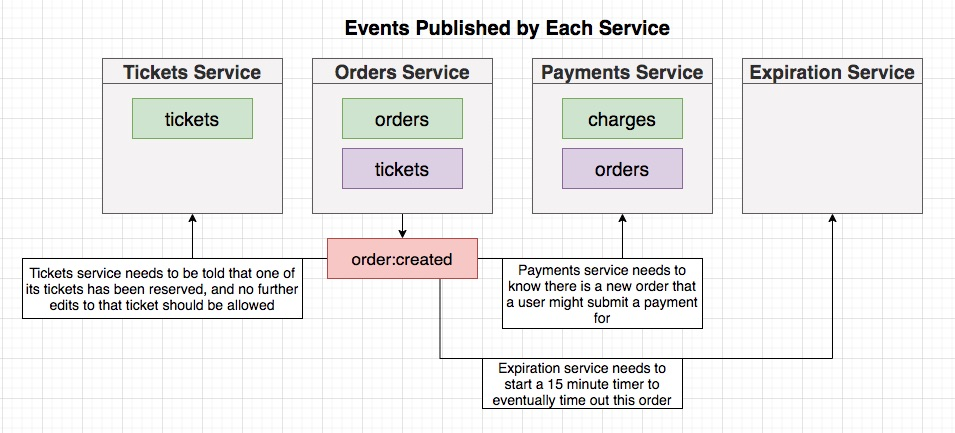
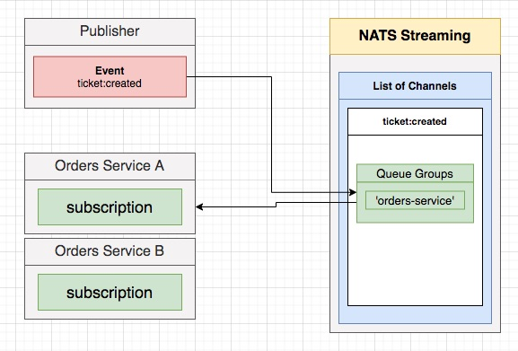
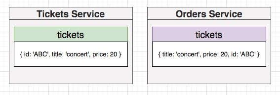
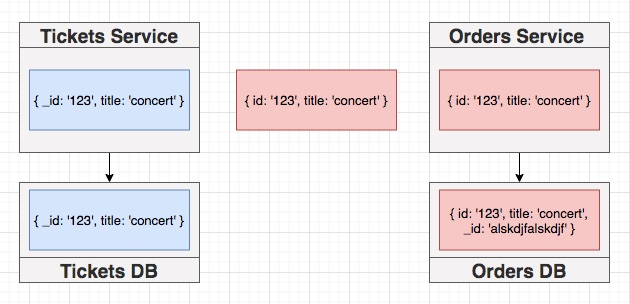

## **Section 19: Listening for Events and Handling Concurrency Issues**

## Table of Contents
- [**Section 19: Listening for Events and Handling Concurrency Issues**](#section-19-listening-for-events-and-handling-concurrency-issues)
- [Table of Contents](#table-of-contents)
  - [Time for Listeners!](#time-for-listeners)
  - [Reminder on Listeners](#reminder-on-listeners)
  - [Blueprint for Listeners](#blueprint-for-listeners)
  - [A Few More Reminders](#a-few-more-reminders)
  - [Simple onMessage Implementation](#simple-onmessage-implementation)
  - [ID Adjustment](#id-adjustment)
  - [Ticket Updated Listener Implementation](#ticket-updated-listener-implementation)
  - [Initializing the Listeners](#initializing-the-listeners)
  - [A Quick Manual Test](#a-quick-manual-test)
  - [Clear Concurrency Issues](#clear-concurrency-issues)
  - [Reminder on Versioning Records](#reminder-on-versioning-records)
  - [Optimistic Concurrency Control](#optimistic-concurrency-control)
  - [Mongoose Update-If-Current](#mongoose-update-if-current)
  - [Implementing OCC with Mongoose](#implementing-occ-with-mongoose)
  - [Testing OCC](#testing-occ)
  - [One More Test](#one-more-test)
  - [Who Updates Versions?](#who-updates-versions)
  - [Including Versions in Events](#including-versions-in-events)
  - [Updating Tickets Event Definitions](#updating-tickets-event-definitions)
  - [Applying a Version Query](#applying-a-version-query)
  - [Did it Work?](#did-it-work)
  - [Abstracted Query Method](#abstracted-query-method)
  - [[Optional] Versioning Without Update-If-Current](#optional-versioning-without-update-if-current)
  - [Testing Listeners](#testing-listeners)
  - [A Complete Listener Test](#a-complete-listener-test)
  - [Testing the Ack Call](#testing-the-ack-call)
  - [Testing the Ticket Updated Listener](#testing-the-ticket-updated-listener)
  - [Success Case Testing](#success-case-testing)
  - [Out-Of-Order Events](#out-of-order-events)
  - [The Next Few Videos](#the-next-few-videos)
  - [Fixing a Few Tests](#fixing-a-few-tests)
  - [Listeners in the Tickets Service](#listeners-in-the-tickets-service)
  - [Building the Listener](#building-the-listener)
  - [Strategies for Locking a Ticket](#strategies-for-locking-a-ticket)
  - [Reserving a Ticket](#reserving-a-ticket)
  - [Setup for Testing Reservation](#setup-for-testing-reservation)
  - [Test Implementation](#test-implementation)
  - [Missing Update Event](#missing-update-event)
  - [Private vs Protected Properties](#private-vs-protected-properties)
  - [Publishing While Listening](#publishing-while-listening)
  - [Mock Function Arguments](#mock-function-arguments)
  - [Order Cancelled Listener](#order-cancelled-listener)
  - [A Lightning-Quick Test](#a-lightning-quick-test)
  - [Don't Forget to Listen!](#dont-forget-to-listen)
  - [Rejecting Edits of Reserved Tickets](#rejecting-edits-of-reserved-tickets)

### Time for Listeners!







**[⬆ back to top](#table-of-contents)**

### Reminder on Listeners

- Extends from Listener class
  - Define subject and queueGroupName variables 
  - Define onMessage function
- Implement Event interface

**[⬆ back to top](#table-of-contents)**

### Blueprint for Listeners

```typescript
import { Message } from 'node-nats-streaming';
import { Subjects, Listener, TicketCreatedEvent } from '@chticketing/common';
import { Ticket } from '../../models/ticket';

export class TicketCreatedListener extends Listener<TicketCreatedEvent> {
  subject: Subjects.TicketCreated = Subjects.TicketCreated;
  queueGroupName = 'orders-service';

  onMessage(data: TicketCreatedEvent['data'], msg: Message) {}
}
```

**[⬆ back to top](#table-of-contents)**

### A Few More Reminders



- Publisher send a ticket:created Event is send to one of any members in orders-service Queue Group

```typescript
export const queueGroupName = 'orders-service';
```

**[⬆ back to top](#table-of-contents)**

### Simple onMessage Implementation


```typescript
  async onMessage(data: TicketCreatedEvent['data'], msg: Message) {
    const { title, price } = data;

    const ticket = Ticket.build({
      title, price
    });
    await ticket.save();

    msg.ack;
  }
```

**[⬆ back to top](#table-of-contents)**

### ID Adjustment



- Need to adjust Id so both tickets data in Tickets and Orders Service have same Id



```typescript
ticketSchema.statics.build = (attrs: TicketAttrs) => {
  return new Ticket({
    _id: attrs.id,
    title: attrs.title,
    price: attrs.price
  });
};
```

```typescript
async onMessage(data: TicketCreatedEvent['data'], msg: Message) {
  const { id, title, price } = data;

  const ticket = Ticket.build({
    id,
    title,
    price,
  });
  await ticket.save();

  msg.ack();
}
```

**[⬆ back to top](#table-of-contents)**

### Ticket Updated Listener Implementation

```typescript
import { Message } from 'node-nats-streaming';
import { Subjects, Listener, TicketUpdatedEvent } from '@chticketing/common';
import { Ticket } from '../../models/ticket';
import { queueGroupName } from './queue-group-name';

export class TicketUpdatedListener extends Listener<TicketUpdatedEvent> {
  subject: Subjects.TicketUpdated = Subjects.TicketUpdated;
  queueGroupName = queueGroupName;

  async onMessage(data: TicketUpdatedEvent['data'], msg: Message) {
    const ticket = await Ticket.findById(data.id);

    if (!ticket) {
      throw new Error('Ticket not found');
    }

    const { title, price } = data;
    ticket.set({ title, price });
    await ticket.save();

    msg.ack();
  }
}
```

**[⬆ back to top](#table-of-contents)**

### Initializing the Listeners

```typescript
  new TicketCreatedListener(natsWrapper.client).listen();
  new TicketUpdatedListener(natsWrapper.client).listen();
```

**[⬆ back to top](#table-of-contents)**

### A Quick Manual Test

- Sign up
- Create Ticket
- Update Ticker

**[⬆ back to top](#table-of-contents)**

### Clear Concurrency Issues
**[⬆ back to top](#table-of-contents)**

### Reminder on Versioning Records
**[⬆ back to top](#table-of-contents)**

### Optimistic Concurrency Control
**[⬆ back to top](#table-of-contents)**

### Mongoose Update-If-Current
**[⬆ back to top](#table-of-contents)**

### Implementing OCC with Mongoose
**[⬆ back to top](#table-of-contents)**

### Testing OCC
**[⬆ back to top](#table-of-contents)**

### One More Test
**[⬆ back to top](#table-of-contents)**

### Who Updates Versions?
**[⬆ back to top](#table-of-contents)**

### Including Versions in Events
**[⬆ back to top](#table-of-contents)**

### Updating Tickets Event Definitions
**[⬆ back to top](#table-of-contents)**

### Applying a Version Query
**[⬆ back to top](#table-of-contents)**

### Did it Work?
**[⬆ back to top](#table-of-contents)**

### Abstracted Query Method
**[⬆ back to top](#table-of-contents)**

### [Optional] Versioning Without Update-If-Current
**[⬆ back to top](#table-of-contents)**

### Testing Listeners
**[⬆ back to top](#table-of-contents)**

### A Complete Listener Test
**[⬆ back to top](#table-of-contents)**

### Testing the Ack Call
**[⬆ back to top](#table-of-contents)**

### Testing the Ticket Updated Listener
**[⬆ back to top](#table-of-contents)**

### Success Case Testing
**[⬆ back to top](#table-of-contents)**

### Out-Of-Order Events
**[⬆ back to top](#table-of-contents)**

### The Next Few Videos
**[⬆ back to top](#table-of-contents)**

### Fixing a Few Tests
**[⬆ back to top](#table-of-contents)**

### Listeners in the Tickets Service
**[⬆ back to top](#table-of-contents)**

### Building the Listener
**[⬆ back to top](#table-of-contents)**

### Strategies for Locking a Ticket
**[⬆ back to top](#table-of-contents)**

### Reserving a Ticket
**[⬆ back to top](#table-of-contents)**

### Setup for Testing Reservation
**[⬆ back to top](#table-of-contents)**

### Test Implementation
**[⬆ back to top](#table-of-contents)**

### Missing Update Event
**[⬆ back to top](#table-of-contents)**

### Private vs Protected Properties
**[⬆ back to top](#table-of-contents)**

### Publishing While Listening
**[⬆ back to top](#table-of-contents)**

### Mock Function Arguments
**[⬆ back to top](#table-of-contents)**

### Order Cancelled Listener
**[⬆ back to top](#table-of-contents)**

### A Lightning-Quick Test
**[⬆ back to top](#table-of-contents)**

### Don't Forget to Listen!
**[⬆ back to top](#table-of-contents)**

### Rejecting Edits of Reserved Tickets
**[⬆ back to top](#table-of-contents)**
