## **Section 20: Worker Services**

## Table of Contents
- [**Section 20: Worker Services**](#section-20-worker-services)
- [Table of Contents](#table-of-contents)
  - [The Expiration Service](#the-expiration-service)
  - [Expiration Options](#expiration-options)
  - [Initial Setup](#initial-setup)
  - [A Touch of Kubernetes Setup](#a-touch-of-kubernetes-setup)
  - [File Sync Setup](#file-sync-setup)
  - [Listener Creation](#listener-creation)
  - [What's Bull All About?](#whats-bull-all-about)
  - [Creating a Queue](#creating-a-queue)
  - [Queueing a Job on Event Arrival](#queueing-a-job-on-event-arrival)
  - [Testing Job Processing](#testing-job-processing)
  - [Delaying Job Processing](#delaying-job-processing)
  - [Defining the Expiration Complete Event](#defining-the-expiration-complete-event)
  - [Publishing an Event on Job Processing](#publishing-an-event-on-job-processing)
  - [Handling an Expiration Event](#handling-an-expiration-event)
  - [Emitting the Order Cancelled Event](#emitting-the-order-cancelled-event)
  - [Testing the Expiration Complete Listener](#testing-the-expiration-complete-listener)
  - [A Touch More Testing](#a-touch-more-testing)
  - [Listening for Expiration](#listening-for-expiration)
  - [Don't Cancel Completed Orders!](#dont-cancel-completed-orders)

### The Expiration Service

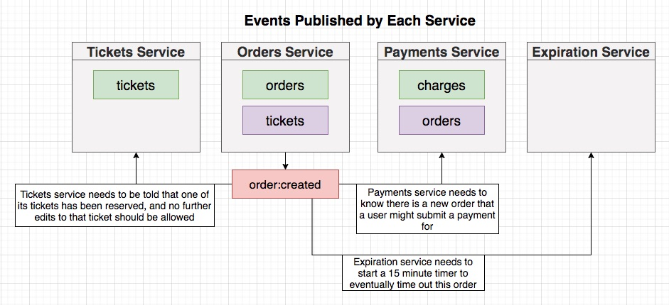
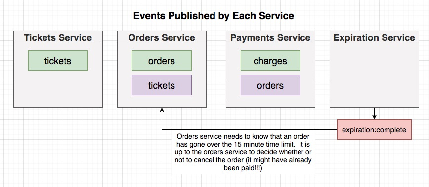

**[⬆ back to top](#table-of-contents)**

### Expiration Options

- Option 1: Use timer
- Option 2: Rely on NATS redelivery mechanism 
- Option 3: Scheduled Event (Not supported by NATS)
- Option 4: Use Bull JS

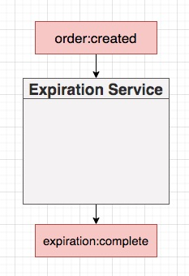
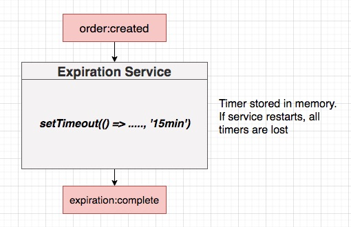
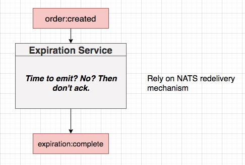
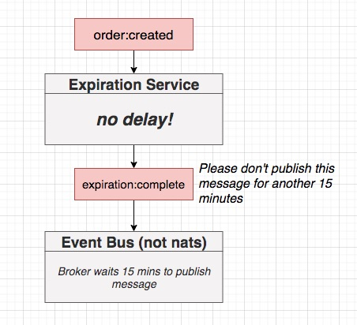
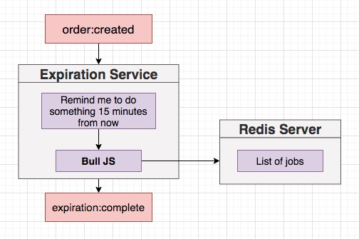

**[⬆ back to top](#table-of-contents)**

### Initial Setup

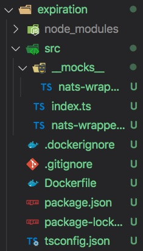

**[⬆ back to top](#table-of-contents)**

### A Touch of Kubernetes Setup

```console
docker build -t chesterheng/expiration .
docker push chesterheng/expiration
```

```yaml
apiVersion: apps/v1
kind: Deployment
metadata:
  name: expiration-redis-depl
spec:
  replicas: 1
  selector:
    matchLabels:
      app: expiration-redis
  template:
    metadata:
      labels:
        app: expiration-redis
    spec:
      containers:
        - name: expiration-redis
          image: redis
---
apiVersion: v1
kind: Service
metadata:
  name: expiration-redis-srv
spec:
  selector:
    app: expiration-redis
  ports:
    - name: db
      protocol: TCP
      port: 6379
      targetPort: 6379
```

```yaml
apiVersion: apps/v1
kind: Deployment
metadata:
  name: expiration-depl
spec:
  replicas: 1
  selector:
    matchLabels:
      app: expiration
  template:
    metadata:
      labels:
        app: expiration
    spec:
      containers:
        - name: expiration
          image: chesterheng/expiration
          env:
            - name: NATS_CLIENT_ID
              valueFrom:
                fieldRef:
                  fieldPath: metadata.name
            - name: NATS_URL
              value: 'http://nats-srv:4222'
            - name: NATS_CLUSTER_ID
              value: ticketing
            - name: REDIS_HOST
              value: expiration-redis-srv
```

**[⬆ back to top](#table-of-contents)**

### File Sync Setup

```yaml
  - image: chesterheng/expiration
    context: expiration
    docker:
      dockerfile: Dockerfile
    sync:
      manual:
        - src: 'src/**/*.ts'
          dest: .
```

**[⬆ back to top](#table-of-contents)**

### Listener Creation

```typescript
export class OrderCreatedListener extends Listener<OrderCreatedEvent> {
  subject: Subjects.OrderCreated = Subjects.OrderCreated;
  queueGroupName = queueGroupName;

  async onMessage(data: OrderCreatedEvent['data'], msg: Message) {}
}
```

**[⬆ back to top](#table-of-contents)**

### What's Bull All About?

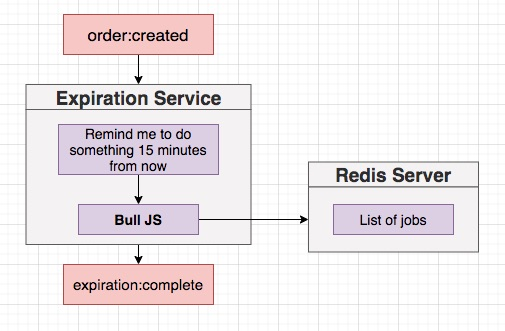
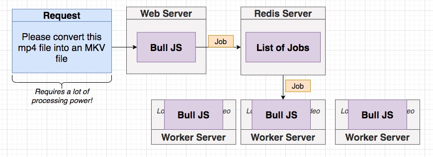
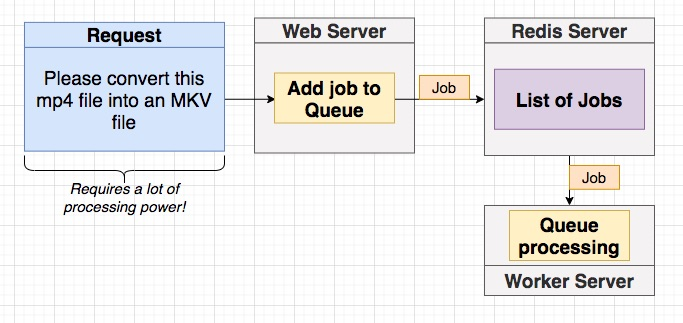

**[⬆ back to top](#table-of-contents)**

### Creating a Queue


```typescript
import Queue from 'bull';

interface Payload {
  orderId: string;
}

const expirationQueue = new Queue<Payload>('order:expiration', {
  redis: {
    host: process.env.REDIS_HOST,
  },
});

expirationQueue.process(async (job) => {
  console.log(
    'I want to publish an expiration:complete event for orderId',
    job.data.orderId
  );
});

export { expirationQueue };
```

**[⬆ back to top](#table-of-contents)**

### Queueing a Job on Event Arrival

```typescript
  async onMessage(data: OrderCreatedEvent['data'], msg: Message) {
    await expirationQueue.add({
      orderId: data.id,
    });

    msg.ack();
  }
```

```typescript
new OrderCreatedListener(natsWrapper.client).listen()
```

**[⬆ back to top](#table-of-contents)**

### Testing Job Processing

- Signup
- Create Ticket
- Create Order

**[⬆ back to top](#table-of-contents)**

### Delaying Job Processing

```typescript
  async onMessage(data: OrderCreatedEvent['data'], msg: Message) {
    const delay = new Date(data.expiresAt).getTime() - new Date().getTime();
    console.log('Waiting this many milliseconds to process the job:', delay);

    await expirationQueue.add(
      {
        orderId: data.id,
      },
      {
        delay,
      }
    );

    msg.ack();
  }
```

**[⬆ back to top](#table-of-contents)**

### Defining the Expiration Complete Event

```typescript
  ExpirationComplete = 'expiration:complete',
```

```typescript
import { Subjects } from './subjects';

export interface ExpirationCompleteEvent {
  subject: Subjects.ExpirationComplete;
  data: {
    orderId: string;
  };
}
```

**[⬆ back to top](#table-of-contents)**

### Publishing an Event on Job Processing

```typescript
import {
  Subjects,
  Publisher,
  ExpirationCompleteEvent,
} from '@chticketing/common';

export class ExpirationCompletePublisher extends Publisher<ExpirationCompleteEvent> {
  subject: Subjects.ExpirationComplete = Subjects.ExpirationComplete;
}
```

**[⬆ back to top](#table-of-contents)**

### Handling an Expiration Event

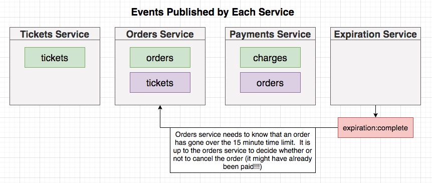

```typescript
export class ExpirationCompleteListener extends Listener<ExpirationCompleteEvent> {
  queueGroupName = queueGroupName;
  subject: Subjects.ExpirationComplete = Subjects.ExpirationComplete;

  async onMessage(data: ExpirationCompleteEvent['data'], msg: Message) {
    const order = await Order.findById(data.orderId);

    if (!order) {
      throw new Error('Order not found');
    }

    order.set({
      status: OrderStatus.Cancelled,
      ticket: null,
    });
  }
}
```

**[⬆ back to top](#table-of-contents)**

### Emitting the Order Cancelled Event

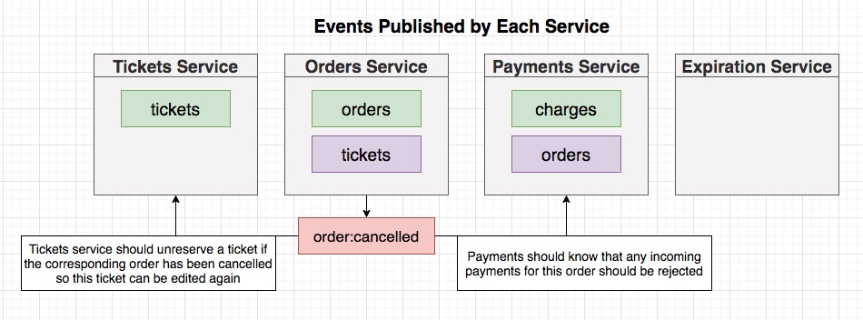

```typescript
  await new OrderCancelledPublisher(this.client).publish({
    id: order.id,
    version: order.version,
    ticket: {
      id: order.ticket.id,
    },
  });
```

**[⬆ back to top](#table-of-contents)**

### Testing the Expiration Complete Listener

```typescript
const setup = async () => {
  const listener = new ExpirationCompleteListener(natsWrapper.client);

  const ticket = Ticket.build({
    id: mongoose.Types.ObjectId().toHexString(),
    title: 'concert',
    price: 20,
  });
  await ticket.save();
  const order = Order.build({
    status: OrderStatus.Created,
    userId: 'alskdfj',
    expiresAt: new Date(),
    ticket,
  });
  await order.save();

  const data: ExpirationCompleteEvent['data'] = {
    orderId: order.id,
  };

  // @ts-ignore
  const msg: Message = {
    ack: jest.fn(),
  };

  return { listener, order, ticket, data, msg };
};
```

**[⬆ back to top](#table-of-contents)**

### A Touch More Testing

```typescript
it('updates the order status to cancelled', async () => {
  const { listener, order, data, msg } = await setup();

  await listener.onMessage(data, msg);

  const updatedOrder = await Order.findById(order.id);
  expect(updatedOrder!.status).toEqual(OrderStatus.Cancelled);
});

it('emit an OrderCancelled event', async () => {
  const { listener, order, data, msg } = await setup();

  await listener.onMessage(data, msg);

  expect(natsWrapper.client.publish).toHaveBeenCalled();

  const eventData = JSON.parse(
    (natsWrapper.client.publish as jest.Mock).mock.calls[0][1]
  );
  expect(eventData.id).toEqual(order.id);
});

it('ack the message', async () => {
  const { listener, data, msg } = await setup();

  await listener.onMessage(data, msg);

  expect(msg.ack).toHaveBeenCalled();
});
```

**[⬆ back to top](#table-of-contents)**

### Listening for Expiration
**[⬆ back to top](#table-of-contents)**

### Don't Cancel Completed Orders!
**[⬆ back to top](#table-of-contents)**